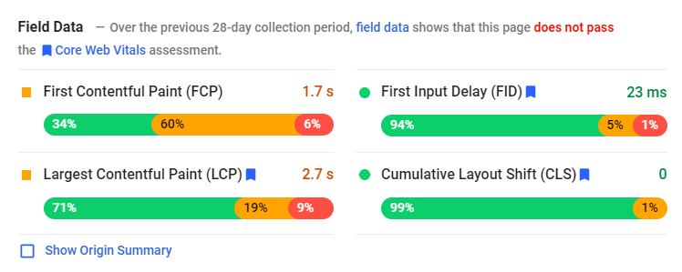
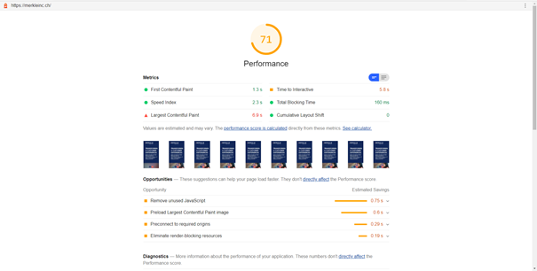
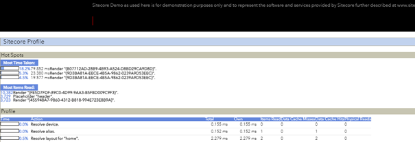
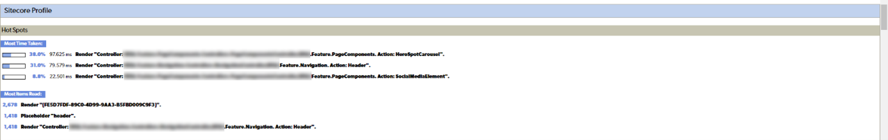
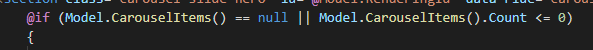
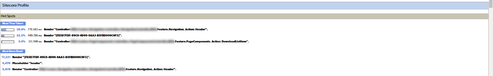

---
title:  "Google Core Web Vitals and SEO"
date:   2021-05-18 12:00 +0100
categories:
- CMS
tags:
- SEO
- performance
author: mklimmasch
--- 

## What are Googles Core Web Vitals and why should you care? 

Googles Core Web Vitals are metrics for the performance of web sites. If this sounds very simple – well, it is. If you have a super-fast, mobile-optimized, and secure web site, you should have no issues with these metrics. If you do not, it might be worth mentioning that Google will begin to incorporate these stats into their scoring algorithm in ~~May~~ June, leading to a penalty for web sites with poor scores. In other words: Improving on your core web vitals might be the most valuable SEO optimization that you can currently invest in. 

It is worth mentioning that the basics of the core web vitals are nothing new, in fact they have been around for a very long time. What changes is simply how google treats them, giving a bonus to websites that follow best practices and hence offer an objectively better user experience. 

## The Core Web Vitals in Detail 

### LCP (Largest Contentful Paint) 

This metric measures the time it takes to display the largest image or text block of a website in the viewport (the visible area of the screen). The idea behind it is that a visitor most likely needs to see this element to decide whether the website contains information relevant to him. Note that this does not consider how long it takes to render the rest of the page, but only what is visible. 

### FID (First Input Delay) 

First input delay measures how long it takes before a user can interact with your website. You probably have had experiences where you opened a website and the menu seems to be broken, just to realize you have to wait a few seconds before it actually works. A low FID value means your website does not have this frustrating behavior 

### CLS (Cumulative Layout Shift) 

This metric measure shifts in the layout that are deemed unexpected. Some websites have pop-ups, slide-ins, overlays, and all other sorts of annoying behaviors that Google will start to punish. But even if you do not have any of the mentioned components, you might score lower when you ignored some best practices. A prominent example is an image that does not have a size set, so it pushes the rest of the page down once it is loaded. 

## How to find your score 

There are basically two ways you can find the score of a single page. 

The most convenient one is to use Lighthouse, a tool that is integrated in Chrome and Edge. To benchmark your website, Open the Developer Tools (F12 in Windows, Alt+CMD+I in MacOS), Select the Tab **Lighthouse** and hit **Generate report**. Note that you can choose between **Mobile** and **Desktop** and the scores differ significantly. This option normally also works with non-public websites, so you can use it to benchmark tests environments. 

> Figure 1: Lighthouse Score of merkleinc.com 

Another option is to use the Online Service **PageSpeed Insights**. For this option, go to https://developers.google.com/speed/pagespeed/insights/ and paste the URL of the website you want to test. If you are using the Google Search Console, this is the tool that will periodically scan all known pages on your website and give you an overview of all your website’s scores. Note that this score is more reliable than the **Lighthouse** version. 

 
> Figure 2: Page Speed Insights of merkleinc.com 

## My Score is bad, what now? 

If you are as curious as me, you now ran the lighthouse on your website, expecting to see a nice wave of green. Unfortunately, chances are high that especially the mobile score is deep red… Yikes! Here is what you can do the improve this score. 

### The Good, the Bad, and the Ugly 

I divided the possible fixes into three groups, from easiest to hardest to fix. Note that these are from experiences: Whether a particular issue is easy or hard to fix depends on your specific implementation. 

#### The Good 

These are changes that are simple to apply, have a high impact, or influence all pages of your website. For example, to **eliminate render-blocking resources**, it is often enough to move some JavaScript to the bottom of the page. There are also opportunities to split, compress, or minify CSS and JS, as well as leaving the fallback font visible during loading of web fonts. All these changes should be fairly easy to implement and test, while improving the score of every single page in your website. 

#### The Bad 

Changes in this group only influence single pages, which means effort grows linear with the number of fixed pages. Although it might be overkill to optimize all pages, you should invest in the most popular ones, with your home page being the first to look at. Still, these changes can normally be implemented in content, meaning you need minimal development resources. The most common task is to replace images with more suitable sizes and better image formats. 

Another type of improvement that I consider to be in this group are component DOM changes. These are changes that influence how the data is **rendered** without going into the detail of how this data is **obtained**. A change like this could be to add a **loading=”lazy”** or a **srcset** attribute to your images. These component DOM changes influence the performance of all pages that use the component and have a low inherent risk, but they still require development resources. 

#### The Ugly 

The last type of fix should only be implemented by your senior developers. It is one that has quite the impact but is also risky and hence requires thorough testing. It influences the response time of your initial request, meaning none of the rendering tasks can start before this is request is complete. What makes these requests slow is normally the gathering of data to display. In most cases the delays are due to mistakes in the code and can be mitigated by improving the code or introduce caching of certain data. The hardest part is typically to find the incrementing piece of code, but Sitecore gives you a nice tool to narrow that down: The **Debug** functionality. Let us look at how that works. 

### Digging into slow components: Sitecore Debug 

To use this functionality, Open the Sitecore Experience Editor and click the **Debug** Button in the **Home** Ribbon. 

> Figure 3: Using the Debug Functionality in the Sitecore 10 Lighthouse Demo 

The Page will reload and look very similar, except for small green arrows on certain components. When you hover over these arrows, you get some additional information regarding the rendering of these components. The most interesting part is all the way down below the page: The Hot Spots. 

> Figure 4: Hot Spots in the Sitecore Lighthouse Demo Start Page 

The hot spots should give you a pretty good understanding which components are taking the longest time to render. If your data source is Sitecore (and not some external system), the time taken is correlated with the number of accessed items (**Most Items Read**). The above screenshot looks quite good, since the slowest 3 components together only take 25% of the rendering time. Compare this with a screenshot I took from a productive system: 

 
Figure 5: Hot Spots in a productive environment 

As you can see, the rendering of the two slowest components takes **almost 70%** of the rendering time, with something called **HeroSpotCarousel** being the biggest resource hog, although it is quite a simple component. Looking at the implementation, it was very simple to see why: Calls to a method called **CarouselItems()** were scattered all over the view, even multiple times within a loop. This means that the data that should have been loaded once for the component was currently loaded between 10 and 50 times.  

> Figure 6: Method call that should have been a property accessor 

Changing this to a lazy-initialized property accessor fixed the issue with pretty much zero risk, and the component disappeared from the Hot Spots. 

> Figure 7: Hot Spots after the quick fix 

The next step would be to look at why the navigation takes so long to render, but this might be a little more complex. But even **HeroSpotCarousel** fix alone brought the server response time for the homepage down from around 1000 to consistently below 200 ms. 

## Conclusion 

In this article, I gave you an overview of what the Core Web Vitals are, how they will impact your search ranking and what you can do in case your score is low. Although it is unclear how strong the impact of these metrics is, I recommend taking measures before your search ranking declines, especially if you are investing in SEO anyway. One man’s loss is another man’s gain: This might be a great opportunity to increase your visibility relative to your competitors. 
