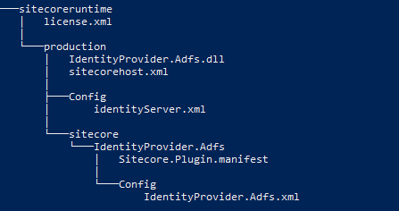
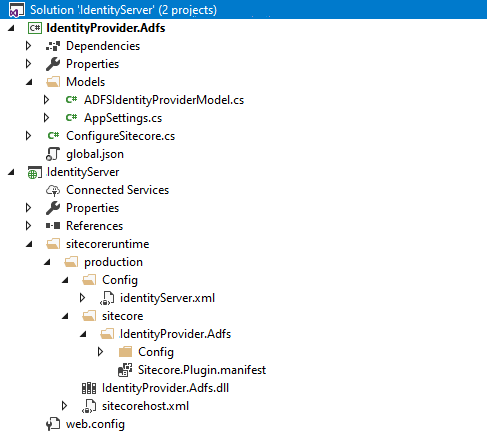
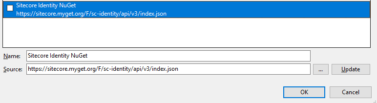
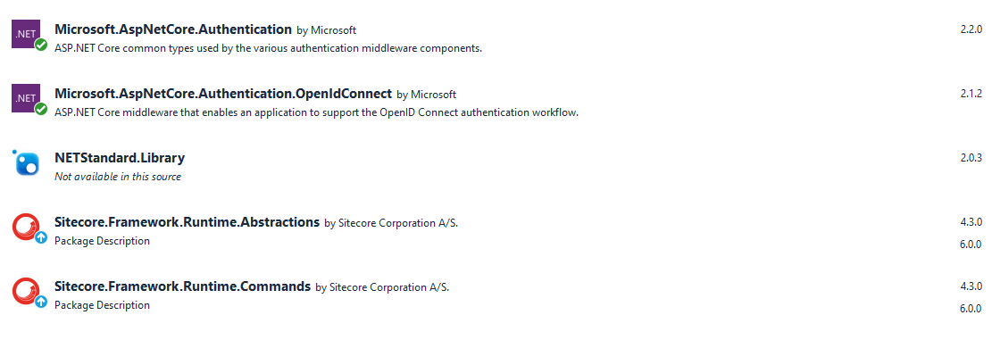
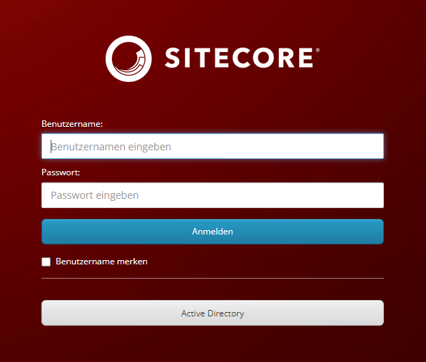
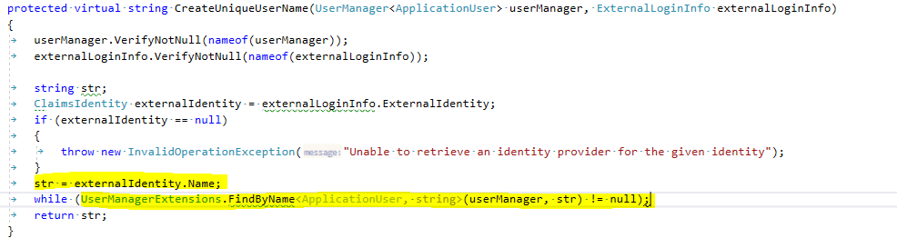

Photo by <a href="https://unsplash.com/@mr_williams_photography?utm_source=unsplash&utm_medium=referral&utm_content=creditCopyText">Micah Williams</a> on <a href="https://unsplash.com/?utm_source=unsplash&utm_medium=referral&utm_content=creditCopyText">Unsplash</a>
  

Sitecore Identity Server is used to authenticate a user on Sitecore. Furthermore it can be used for federated authentication for your frontend-login.

In this post I will show you how you can integrate Sitecore Identity Server using OpenIdConnect to connect your Active Directory with ADFS (Active Directory Federation Services). It should give you a brief overview over the technical implementation in order to authenticate your Sitecore users to your Sitecore instance.

## Identity Server

First of all let's start to configure the Identity Server and create the plugin to connect your user with OpenIdConnect to your Active Directory.

### Folder Structure

Every customization I did on the Identity Server for our own plugin is placed in the "sitecoreruntime" folder, which is installed by default with your Identity Server. It is located directly in the root folder of the Identity Server.

The structure of your folder must in the end look like in the following image:

:exclamation: It is important, that this structure must be kept, otherwise the plugin wouldn't work.



To give a brief overview over all files, they are described in the next table. 

| File | Description |
| ----------- | ----------- |
| license.xml | The licence file from Sitecore. |
| IdentityProvider.Adfs.dll | The dll file that controls the connection to the provider. In the following case the single sign-on connection to the Active Directory using OpenIdConnect. |
| sitecorehost.xml | Patch file of sitecorehost.xml, which is located in the root of the Identity Server folder. <br />Used to set the log level and log path. |
| identityServer.xml | Patch file of identityServer.xml, which is located in \sitecore\Sitecore.Plugin.IdentityServer\Config. <br />You can patch several fundamental options like password hash algorithm, custom identity claims, allowedCorsOrigins etc. |
| Sitecore.Plugin.manifest | Definition file for the custom plugin. |
| IdentityProvider.Adfs.xml | Custom identity provider configuration. Contains data to connect to the ADFS (Active Directory Federation Services) as well as several claim transformations. |


In order to speed up the creation of the files. Copy the sample files from Sitecore.Plugin.IdentityProvider.AzureAd which you can find in your default installation of the Idenity Server under the following path: /sitecore/Sitecore.Plugin.IdentityProvider.AzureAd

I will also post my sample files at the end of each chapter.

### Custom Identity Provider Plugin

To connect the Identity Server to an external Active Directory, a plugin needs to be created. The plugin consists of the following files: 

* Identity provider configuration (IdentityProvider.Adfs.xml)
* Plugin manifest (Sitecore.Plugin.manifest)
* Assembly (IdentityProvider.Adfs.dll)

#### Identity provider configuration

The Identity Provider configuration contains all necessary data for the connection to the Active Directory. Furthermore, all claim transformations, which are necessary for the user administration, are configured here. 
To make the creation easier, copy the file from /sitecore/Sitecore.Plugin.IdentityProvider.AzureAd/Config and adapt it to your needs.

The following things need to be adapted:

##### General Configuration

| Tag | Description |
| ----------- | ----------- |
| AuthenticationScheme | The scheme used for the connection. |
| DisplayName | Name, which is displayed at the button for login into Sitecore. |
| Enabled | Activation of the plugin. |

Example configuration:
```xml
<AuthenticationScheme>adfs</AuthenticationScheme>
<DisplayName>Custom Active Directory</DisplayName>
<Enabled>true</Enabled>
```

##### Custom Data
| Tag | Description |
| ----------- | ----------- |
| ClientId | Client identifier which is configured in Active Directory (ADFS Application) |
| Authority | URI of the authority on which you want to authenticate to. |
| MetaAddress | URI of the public reachable metadata. (.xm-file) |

##### Claim Transformation

In order to transform your claims you get from your Active Directory, you can do the transformation directly in your Identity server. For that reason, Sitecore basically defines five claims, which can be transformed. These are: 

* name
* email
* role
* http://www.sitecore.net/identity/claims/isAdmin
* http://www.sitecore.net/identity/claims/originalIssuer

A transformation from the data which are represented in the claims from the Active Directory can be done directly in the xml-configuration of the plugin. Therefore you have to define the claim which you get from your active directory in "SourceClaims".In the "NewClaims" you have to define the target claim to transform the data to.

The following example shows an example of the email address which you get from the Active Directory data and transform it to the by default predefined email claim.

```xml
<ActiveDirectoryEmailTransformation type="Sitecore.Plugin.IdentityProviders.DefaultClaimsTransformation, Sitecore.Plugin.IdentityProviders">
	<SourceClaims>
		<Claim1 type="http://schemas.xmlsoap.org/ws/2005/05/identity/claims/upn"/>
	</SourceClaims>
	<NewClaims>
		<Claim1 type="email"/>
	</NewClaims>
</ActiveDirectoryEmailTransformation >
```

In addition to transformation, the source claims can be checked for certain values and thus transformed. This can be used e.g. for the transformation of the Active Directory groups to the roles, which are defined in your Sitecore instance.

For example: 

```xml
<ActiveDirectoryGroupTransformationAdmin type="Sitecore.Plugin.IdentityProviders.DefaultClaimsTransformation, Sitecore.Plugin.IdentityProviders">
	<SourceClaims>
		<Claim1 type="http://schemas.microsoft.com/ws/2008/06/identity/claims/group" value="Sitecore_Admin"/>
	</SourceClaims>
	<NewClaims>
		<Claim1 type="http://www.sitecore.net/identity/claims/isAdmin" value="true"/>
		<Claim2 type="comment"/>
	</NewClaims>
</ActiveDirectoryGroupTransformationAdmin>
```

Here the Active Directory groups are checked for the value "Sitecore_Admin". If the group is found, the admin is set to "true" and the value "Sitecore_Admin" is written into the claim 'comment'.

Hints:

* If several "SourceCalims"are specified, they are linked with a logical AND.
* If more two claims are specified in "NewClaims", both data are transferred.

It is also possible to define custom claims in which you want to transform your data. This is done for example with the claim "comment" in the previous example.

#### Identity Server Configuration

In order to customize the Identity Server configuration itself, copy the default configuration of idenityServer.xml from path sitecore/Sitecore.Plugin.IdentityServer/Config and place it in our structure to /sitecoreruntime/production/Config.

We actually don't need to patch all entries, therefore we delete all entries we do not want to change.

For our example we have to configure the following entries:

* PasswordHashAlgorithm set to SHA512
* UserClaims for our custom claims 
* AllowedCorsOriginsGroups to enable several Sitecore instances to use the Identity Server.

##### Custom Claims
To use custom claims (such as the comment in the previous example), they must be configured in the identityServer.xml file you created before.
In the following example we configured two additional claims, comment and fullName:

```xml
 <IdentityResources>
    <SitecoreIdentityResource>
        <Name>sitecore.profile</Name>
        <UserClaims>
            <UserClaim1>name</UserClaim1>
            <UserClaim2>email</UserClaim2>
            <UserClaim3>role</UserClaim3>
            <UserClaim4>http://www.sitecore.net/identity/claims/isAdmin</UserClaim4>
            <UserClaim5>http://www.sitecore.net/identity/claims/originalIssuer</UserClaim5>
            <UserClaim6>comment</UserClaim6>
            <UserClaim7>fullName</UserClaim7>
        </UserClaims>
        <Required>true</Required>
    </SitecoreIdentityResource>
</IdentityResources>
```

But this is not enough that custom claims works with Sitecore. Therefore each individual claim must be mapped in Sitecore as well. The mapping of a custom claim in Sitecore is explained in the chapter "Identity Server configuration in Sitecore".

##### Allowed Cors Origins

If you need to enable access to the IdentityServer for several Sitecore instances, this can also be done here.
Therefore a new entry of AllowedCorsOrigins must be created in the Identity Server. As the previous applied entries, this one is also entered directly in the 'identityServer.xml' configuration file.

```xml
<Clients>
        <DefaultClient>
          <AllowedCorsOrigins>
            <AllowedCorsOriginsGroup1>http://{SitecoreInstance1}|https://{SitecoreInstance1}</AllowedCorsOriginsGroup2>
            <AllowedCorsOriginsGroup2>http://{SitecoreInstance2}|https://{SitecoreInstance2}</AllowedCorsOriginsGroup3>
          </AllowedCorsOrigins>
        </DefaultClient>	
      </Clients>
```


#### Sample Files

**identityServer.xml**

```xml
<?xml version="1.0" encoding="utf-8"?>
<Settings>
    <Sitecore>
        <IdentityServer>
            <SitecoreMembershipOptions>
                <!-- Supported algorithms: SHA1, SHA256, SHA384, SHA512, HMACSHA1, HMACSHA256, HMACSHA384, HMACSHA512. -->
                <PasswordHashAlgorithm>SHA512</PasswordHashAlgorithm>
            </SitecoreMembershipOptions>
            <!--Add additional user claims here-->
            <IdentityResources>
                <SitecoreIdentityResource>
                    <Name>sitecore.profile</Name>
                    <UserClaims>
                        <UserClaim1>name</UserClaim1>
                        <UserClaim2>email</UserClaim2>
                        <UserClaim3>role</UserClaim3>
                        <UserClaim4>http://www.sitecore.net/identity/claims/isAdmin</UserClaim4>
                        <UserClaim5>http://www.sitecore.net/identity/claims/originalIssuer</UserClaim5>
                        <UserClaim6>comment</UserClaim6>
                        <UserClaim7>fullName</UserClaim7>
                    </UserClaims>
                    <Required>true</Required>
                </SitecoreIdentityResource>
            </IdentityResources>
 
            <!--Add additional user claims here-->
            <ApiResources>
                <SitecoreApiResource>
                    <Name>sitecore.profile.api</Name>
                    <DisplayName>Sitecore API</DisplayName>
                    <ApiSecrets>
                    </ApiSecrets>
                    <UserClaims>
                        <UserClaim1>name</UserClaim1>
                        <UserClaim2>email</UserClaim2>
                        <UserClaim3>role</UserClaim3>
                        <UserClaim4>http://www.sitecore.net/identity/claims/isAdmin</UserClaim4>
                        <UserClaim5>http://www.sitecore.net/identity/claims/originalIssuer</UserClaim5>
                        <UserClaim6>comment</UserClaim6>
                        <UserClaim7>fullName</UserClaim7>
                    </UserClaims>
                </SitecoreApiResource>
            </ApiResources>
 
            <AccountOptions>
                <AllowPasswordRecovery>false</AllowPasswordRecovery>
            </AccountOptions>
 
            <!--Trust additional sites here-->
            <Clients>
                <DefaultClient>
                    <AllowedCorsOrigins>
                        <AllowedCorsOriginsGroup1>http://{SitecoreInstance}|https://{SitecoreInstance}</AllowedCorsOriginsGroup1>
                    </AllowedCorsOrigins>
                </DefaultClient>
            </Clients>
        </IdentityServer>
    </Sitecore>
</Settings>
```

**IdentityProvider.Adfs.xml**

```xml
<?xml version="1.0" encoding="utf-8"?>
    <Settings>
        <Sitecore>
            <ExternalIdentityProviders>
                <IdentityProviders>
                    <ADFS type="Sitecore.Plugin.IdentityProviders.IdentityProvider, Sitecore.Plugin.IdentityProviders">
                        <AuthenticationScheme>adfs</AuthenticationScheme>
                        <DisplayName>Active Directory</DisplayName>
                        <Enabled>true</Enabled>
                        <ClientId>{ClientId}</ClientId>
                        <Authority>{Authority}</Authority>
                        <MetaAddress>{MetaAddress}</MetaAddress>
                        <ErrorPage>{ErrorPage}</ErrorPage>
                        <ClaimsTransformations>
                            <!--Place transformation rules here. -->
                            <ActiveDirectoryEmailTransformation type="Sitecore.Plugin.IdentityProviders.DefaultClaimsTransformation, Sitecore.Plugin.IdentityProviders">
                                <SourceClaims>
                                    <Claim1 type="http://schemas.xmlsoap.org/ws/2005/05/identity/claims/upn"/>
                                </SourceClaims>
                                <NewClaims>
                                    <Claim1 type="email"/>
                                </NewClaims>
                            </ActiveDirectoryEmailTransformation >
                            <ActiveDirectoryNameTransformation type="Sitecore.Plugin.IdentityProviders.DefaultClaimsTransformation, Sitecore.Plugin.IdentityProviders">
                                <SourceClaims>
                                    <Claim1 type="http://schemas.microsoft.com/ws/2008/06/identity/claims/windowsaccountname"/>
                                </SourceClaims>
                                <NewClaims>
                                    <Claim1 type="name"/>
                                </NewClaims>
                            </ActiveDirectoryNameTransformation>
                            <ActiveDirectoryFullNameTransformation type="Sitecore.Plugin.IdentityProviders.DefaultClaimsTransformation, Sitecore.Plugin.IdentityProviders">
                                <SourceClaims>
                                    <Claim1 type="http://schemas.xmlsoap.org/ws/2005/05/identity/claims/name"/>
                                </SourceClaims>
                                <NewClaims>
                                    <Claim1 type="fullName"/>
                                </NewClaims>
                            </ActiveDirectoryFullNameTransformation>
                            <ActiveDirectoryGroupTransformationAdmin type="Sitecore.Plugin.IdentityProviders.DefaultClaimsTransformation, Sitecore.Plugin.IdentityProviders">
                                <SourceClaims>
                                    <Claim1 type="http://schemas.microsoft.com/ws/2008/06/identity/claims/group" value="Sitecore_Admin"/>
                                </SourceClaims>
                                <NewClaims>
                                    <Claim1 type="http://www.sitecore.net/identity/claims/isAdmin" value="true"/>
                                    <Claim2 type="comment"/>
                                </NewClaims>
                            </ActiveDirectoryGroupTransformationAdmin>
                        </ClaimsTransformations>
                    </ADFS>
                </IdentityProviders>
            </ExternalIdentityProviders>
        </Sitecore>
    </Settings>
```


#### The Plugin

Last but not least we have to create our plugin which connects the Active Directory using OpenIdConnect.

The plugin consists of two elements:

* Assembly, where the whole magic happens
* Plugin manifest, which represents the configuration of the plugin

##### Assembly

To create your custom assembly we create a Visual Studio project which structure in the end will look like the following:



We have two different projects included in the solution. The first one is the custom written plugin to connect the Active Directory with OpenIdConnect, the second is a .NET Web Application in order to deploy the files locally.

In the following chapter I will briefly go trough the creation of the project and the code for the plugin.

###### Create the plugin

To create the plugin which connects the Active Directory using OpenIdConnect, you have to follow the steps below:

1. Create a Class Library project targeting .NET Standard 2.0 framework

2. Add Sitecore-Identity Nuget source (https://sitecore.myget.org/F/sc-identity/api/v3/index.json)



3. Install required Nuget packages



4. Create global.json file at the root of the project. It is necessary to specify the version of the package. Be aware, that the version defined in the json-file need to be the same like the version defined in plugin manifest, which we will create afterwards.

```JSON
{
    "msbuild-sdks": {
        "Sitecore.Framework.Runtime.Build": "1.1.0"
    }
}
```

5. Bring down the code for your plugin to connect to Active Directory using OpenIdConnect

**Models**

In order to structure the code we create two models, which later are used in the ConfigureSitecore class.

In the ADFSIdentiyProviderModel class we create a model to bind the properties which we defined before in IdentityProvider.Adfs.xml. 

ADFSIdentityProviderModel: 
```C#
public class ADFSIdentityProviderModel
{
    public bool Enabled { get; set; }
    public string Authority { get; set; }
    public string ClientId { get; set; }
    public string AuthenticationScheme { get; set; }
    public string MetadataAddress { get; set; }
    public string DisplayName { get; set; }
    public string ErrorPage { get; set; }
}
```

The class AppSettings defines settings and creates the ADFSIdentityProvider. 
Consider that the SectionName is the configured IdentityProvider section name defined in IdentityProvider.Adfs.xml.

AppSettings:
```C#
public class ADFSIdentityProviderModel
public class AppSettings
{
    public static readonly string SectionName = "Sitecore:ExternalIdentityProviders:IdentityProviders:ADFS";
    public ADFSIdentityProviderModel ADFSIdentityProvider { get; set; } = new ADFSIdentityProviderModel();
}
```

**Configure Sitecore Class**

This class includes the whole code to connect the Sitecore Identity Server to the Active Directory.

```C#
using IdentityProvider.Adfs.Models;
using Microsoft.AspNetCore.Authentication;
using Microsoft.AspNetCore.Authentication.OpenIdConnect;
using Microsoft.Extensions.Configuration;
using Microsoft.Extensions.DependencyInjection;
using Microsoft.Extensions.Logging;
using Sitecore.Framework.Runtime.Configuration;
using System.Threading.Tasks;
 
namespace IdentityProvider.Adfs
{
    public class ConfigureSitecore
    {
        private readonly ILogger<ConfigureSitecore> _logger;
        private readonly AppSettings _appSettings;
 
        public ConfigureSitecore(ISitecoreConfiguration scConfig, ILogger<ConfigureSitecore> logger)
        {
            _logger = logger;
            _appSettings = new AppSettings();
            scConfig.GetSection(AppSettings.SectionName);
            scConfig.GetSection(AppSettings.SectionName).Bind(_appSettings.ADFSIdentityProvider);
        }
 
        public void ConfigureServices(IServiceCollection services)
        {
            ADFSIdentityProviderModel adfsProvider = _appSettings.ADFSIdentityProvider;
            if (!adfsProvider.Enabled)
            {
                return;
            }
 
            _logger.LogInformation($"Adding ADFS clientId {adfsProvider.ClientId} Authority {adfsProvider.Authority} Scheme {adfsProvider.AuthenticationScheme}");
 
            new AuthenticationBuilder(services).AddOpenIdConnect(adfsProvider.AuthenticationScheme, adfsProvider.DisplayName, options =>
            {
                options.SignInScheme = "idsrv.external";
                options.SignOutScheme = "idsrv";
                options.RequireHttpsMetadata = false;
                options.SaveTokens = true;
                options.Authority = adfsProvider.Authority;
                options.ClientId = adfsProvider.ClientId;
                options.ResponseType = "id_token";
                options.MetadataAddress = adfsProvider.MetadataAddress;
 
                options.Events = new OpenIdConnectEvents
                {
                    OnRemoteFailure = context =>
                    {
                        context.Response.Redirect(adfsProvider.ErrorPage);
                        context.HandleResponse();
                        return Task.FromResult(0);
                    }
                };
            });
        }
    }
}
```

That's it for the Class Library.

6. The second part of the solution is a .NET Web Application in order to deploy the files locally. The only thing we have to do here is to build up the folder structure I showed in the very start of the blogpost and add all files to it.

In order to copy the Assembly from our previous created Class Library to our "Deployment Project", we placed a Build Event into the Class Library project. We used xcopy to copy the builded assembly to our folder.

For exmple: xcopy "$(TargetDir)IdentityProvider.Adfs.dll" "$(ProjectDir)..\IdentityServer\sitecoreruntime\production\" /Y

By using publishing profiles we also excluded bin folder and web.config file from deployment in the .Net Web Application.

##### Plugin Manifest

The plugin manifest represents the definition of your custom plugin. It will be automatically created during the build.

| Attribute | Description |
| ----------- | ----------- |
| AssemblyName | The name of the assembly file. |
| PluginName | The name of the plugin where the custom data are configured respectively the name of the identity provider configuration file. |
| Version | The version defined in your assembly. |

For Example:
```xml
<?xml version="1.0" encoding="utf-8"?>
<SitecorePlugin PluginName="IdentityProvider.Adfs" AssemblyName="IdentityProvider.Adfs" Version="1.0.0">
  <Dependencies />
  <Tags />
</SitecorePlugin>
```

After you deployed everything to your Identity Server you have to restart your application pool in IIS.

Now you have done all the configuration and coding for your Identity Server. You finally have connected your Identity Server to your Active Directory using OpenIdConnect.




## Customizations in Sitecore

In order to use the transformations of the Identity Server in Sitecore, some adjustments have to be made in Sitecore. On the one hand the transformations have to be mapped in the 'Sitecore.Owin.Authentication.IdentityServer.config', on the other hand the UserBuilder has to be adapted, if the general approach from Sitecore isn't the way to go. But let's have a look at it:

### Identity Server configuration in Sitecore

The mapping of the custom claims from Identity Server will be done in Sitecore  in the Sitecore.Owin.Authentication.IdentityServer.config. 
The following examples patches the default configuration to map the name to the Full Name, the email address and the custom claim comment. All mappings are mapped to already existing properties of Sitecore, so no customization in the Sitecore code is necessary.

```xml
<federatedAuthentication>
	<propertyInitializer>
		<maps>
			<map name="set Email" type="Sitecore.Owin.Authentication.Services.DefaultClaimToPropertyMapper, Sitecore.Owin.Authentication" resolve="true">
				<data hint="raw:AddData">
					<source name="email" />
					<target name="Email" />
				</data>
			</map>
			<map name="set FullName" type="Sitecore.Owin.Authentication.Services.DefaultClaimToPropertyMapper, Sitecore.Owin.Authentication" resolve="true">
				<data hint="raw:AddData">
					<source name="fullName" />
					<target name="FullName" />
				</data>
			</map>
			<map name="set Comment" type="Sitecore.Owin.Authentication.Services.DefaultClaimToPropertyMapper, Sitecore.Owin.Authentication" resolve="true">
				<data hint="raw:AddData">
					<source name="comment" />
					<target name="Comment" />
				</data>
			</map>
		</maps>
	</propertyInitializer>
</federatedAuthentication>
```

### External User Builder

By default, Sitecore creates user names with its own user builder. This results in cryptic names such as sitecore\hjHvoPT9L7. In order to show human readable user names, the UserBuilder must be modified. This requires an adjustment in the configuration, as well as in the code.

#### Code
With the claim transformations we have already created the prerequisite in Identity Server so that the name is transferred to Sitecore from the Active Directory and is available in the ExternalLoginInfos. Therefore only a small part of the code from Sitecore's ExternalUserBuilder needs to be overwritten. In concrete terms, this is only the creation of the name, which need a slight adaption.



#### Configuration

In order to use the CustomExternalUserBuilder, the configuration needs to be patched. For example like this:

```xml
<?xml version="1.0" encoding="utf-8" ?>
<configuration xmlns:patch="http://www.sitecore.net/xmlconfig/">
    <sitecore>
        <federatedAuthentication >
            <identityProvidersPerSites >
                <mapEntry name="all sites">
                    <externalUserBuilder type="Sitecore.Owin.Authentication.Services.DefaultExternalUserBuilder, Sitecore.Owin.Authentication">
                        <patch:attribute name="type">FederatedAuthentication.ExternalUserBuilder, Authentication.Extensions</patch:attribute>
                    </externalUserBuilder>
                </mapEntry>
            </identityProvidersPerSites>
        </federatedAuthentication>
    </sitecore>
</configuration>
```

Now your users displayed in Sitecore should have readable names like they are defined in your Active Directory.


## Summary
In the post I gave you an example how you could connect your Identity Server to your Acitve Directory using OpenIdConnect. 

Finally, I would like to give an overview of all the necessary steps for our approach:

* Configure your Idenity Server by placing all necessary data for your authentication in your idenity provider configuration
* Transform the claims you get from your Active Directory
* Customize the Identity Server configuration to your needs
* Write the plugin code to use OpenIdConnect for the authentication
* Configure custom claims in Sitecore
* Change the external user builder in Sitecore