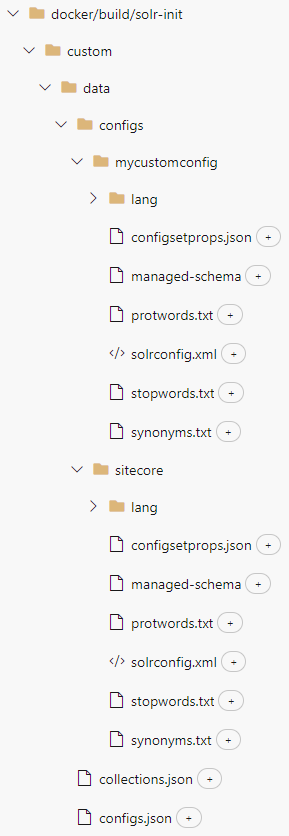

Sitecore's docker containers already ship with the possibility to add custom Solr indexes as [described by Koen Heye](https://www.koenheye.be/sitecore-101-custom-solr-indexes/).

However, this comes with certain limitations:

- Index prefixes are restricted to "sitecore_" or "xdb_"
- Even though there is a possibility to customize the base config's xml files using xslt, we can't use different config sets for individual indexes
- We can't alter certain files in the base config set (e.g. stopwords*.txt)

This blog post aims to get rid of those limitations. All the following code samples were developed and tested in Sitecore 10.2 and should be applicable for Sitecore 10.1+. Since the `solr-init` container was introduced in Sitecore 10.1 this approach won't work prior to that version. It is also important to note that we are not going to alter existing functionality but rather put it on top.

## Information structure

Before we start customizing any scripts, we want to define the information structure which tells the entrypoint script which indexes should be created and which config sets those indexes will use. For this purpose we are going to introduce two new json files (we will leave the cores*.json untouched to not break any standard functionality):

### collections.json


{
    "collections": [
        {
          "name": "myclient_master_index",
          "alias": "myclient_master_indexMainAlias",
          "config": "mycustomconfig"
        },
        {
          "name": "sitecore_master_index",
          "config": "sitecore_master_index_config"
        }
    ]
}


Since Sitecore's `solr` container runs in SolrCloud mode we are using the term "collections" to define our indexes. The first index "myclient_master_index" defines a new custom index with a custom config set. For custom indexes we also need to define an alias. The second index is an already existing one where we just want to update the config set. In this case no alias is needed since it will be automatically created by the base scripts of the `solr-init` container.

Place this files at /docker/build/solr-init/custom/data/collections.json

### configs.json


{
    "configs": [
        {
          "name": "mycustomconfig",
          "path": "configs\\mycustomconfig"
        },
        {
          "name": "sitecore_master_index_config",
          "path": "configs\\sitecore"
        }
    ]
}


In this file we define the config sets which need to be created (mycustomconfig) or altered (sitecore_* or xdb_*).

Place this files at /docker/build/solr-init/custom/data/configs.json

#### Provide custom configs sets

As you can see in the json file, the actual config set files will be placed under /docker/build/solr-init/custom/data/configs:

If you want to start based on the default config set provided by Sitecore you can just download it with the following script (btw, this is the Download-SolrConfig.ps1 which is available in the `solr-init` container). Make sure the `solr` container is running:


param(
    [Parameter(Mandatory)]
    [string]$SolrEndpoint,

    [Parameter(Mandatory)]
    [string]$OutPath,

    [string]$DefaultConfigSetName = "_default"
)

function Download-FileItem {
    param(
        [string]$SolrEndpoint,
        $FileItem,
        [string]$OutPath
    )
    Write-Host "Downloading '$($FileItem.text)' file"
    $fileContent = (Invoke-RestMethod -Uri "$SolrEndpoint/$($FileItem.a_attr.href)" -Credential (Get-SolrCredential)).znode.data
    #File content should have "UTF-8 without BOM" encoding
    [System.IO.File]::WriteAllLines("$OutPath\$($FileItem.text)", $fileContent)
}

function Download-FolderItem {
    param (
        $SolrEndpoint,
        $FolderItem,
        $OutPath
    )
    $SubFolderItems = $($FolderItem.children | Where-Object { $_.children })
    foreach ($subFolder in $SubFolderItems) {
        Download-FolderItem -SolrEndpoint $SolrEndpoint -Folder $subFolder -OutPath "$OutPath\$($subFolder.text)"
    }
    $FileItems = $FolderItem.children | Where-Object { -not $_.children }
    if($FileItems) {
        New-Item -Path $OutPath -ItemType Directory -Force | Out-Null
        foreach ($file in $FileItems) {
            Download-FileItem -SolrEndpoint $SolrEndpoint -FileItem $file -OutPath $OutPath
        }
    }
}

Write-Host "Downloading '$DefaultConfigSetName' SOLR config set"
$ConfigDir = Invoke-RestMethod -Uri "$SolrEndpoint/admin/zookeeper?detail=true&path=%2Fconfigs%2F$DefaultConfigSetName&wt=json" -Credential (Get-SolrCredential)

Download-FolderItem -SolrEndpoint $SolrEndpoint -FolderItem $ConfigDir.tree[0] -OutPath "$OutPath"


## Add new functionality

Now we are ready to introduce new functionalty. As already mentioned, we won't alter the existing Start.ps1 script and only build new functionality on top of it. Therefore we will introduce a new Start-Custom.ps1 which utilizes the standard Start.ps1 in it. This Start-Custom.ps1 will be later used as the new entry point for the `solr-init` container.

### Start-Custom.ps1


param(
    [Parameter(Mandatory)]
    [string]$SitecoreSolrConnectionString,

    [Parameter(Mandatory)]
    [string]$SolrSitecoreConfigsetSuffixName,

    [Parameter(Mandatory)]
    [string]$SolrCorePrefix,

    [Parameter(Mandatory)]
    [string]$SolrReplicationFactor,

    [Parameter(Mandatory)]
    [int]$SolrNumberOfShards,
    
    [Parameter(Mandatory)]
    [int]$SolrMaxShardsPerNodes,

    [string]$SolrXdbSchemaFile,
    
    [string]$SolrCollectionsToDeploy
)

$contextPath = "C:\data"

.\Start.ps1 -SitecoreSolrConnectionString $SitecoreSolrConnectionString -SolrCorePrefix $SolrCorePrefix -SolrSitecoreConfigsetSuffixName $SolrSitecoreConfigsetSuffixName -SolrReplicationFactor $SolrReplicationFactor -SolrNumberOfShards $SolrNumberOfShards -SolrMaxShardsPerNodes $SolrMaxShardsPerNodes -SolrXdbSchemaFile .\\data\\schema.json -SolrCollectionsToDeploy $SolrCollectionsToDeploy

. .\Get-SolrCredential.ps1

$solrContext = .\Parse-ConnectionString.ps1 -SitecoreSolrConnectionString $SitecoreSolrConnectionString

$SolrEndpoint = $solrContext.SolrEndpoint
$env:SOLR_USERNAME = $solrContext.SolrUsername
$env:SOLR_PASSWORD = $solrContext.SolrPassword

# Load configs from json
$configs = $null
if(Test-Path -Path "$contextPath\configs.json") {
    $configs = ((Get-Content "$contextPath\configs.json" | Out-String | ConvertFrom-Json).configs)
}

# Create or update all configs
foreach ($config in $configs) {
    .\Update-SolrConfig.ps1 -SolrEndpoint $SolrEndpoint -SolrConfigName $config.name -SolrConfigDir "$contextPath\$($config.path)"
}

# Load collections from json
$solrCores = $null
if(Test-Path -Path "$contextPath\collections.json") {
    $solrCores = ((Get-Content "$contextPath\collections.json" | Out-String | ConvertFrom-Json).collections)
}

# Create new collections
$solrCollections = (Invoke-RestMethod -Uri "$SolrEndpoint/admin/collections?action=LIST&omitHeader=true" -Method Get -Credential (Get-SolrCredential)).collections
foreach ($solrCore in $solrCores) {   
    if ($solrCollections -contains $solrCore.name) {
        .\Reload-SolrCollection.ps1 -SolrEndpoint $SolrEndpoint -SolrCollectionName $solrCore.name
        
        Write-Information -MessageData "$($solrCore.name) already exists and has been reloaded." -InformationAction:Continue
        continue
    }
        
    .\New-SolrCollection.ps1 -SolrEndpoint $SolrEndpoint -SolrCollectionName $solrCore.name -SolrConfigsetName $solrCore.config -SolrReplicationFactor $SolrReplicationFactor -SolrNumberOfShards $SolrNumberOfShards -SolrMaxShardNumberPerNode $SolrMaxShardsPerNodes

    if($solrCore.alias) {
        .\New-SolrAlias.ps1 -SolrEndpoint $SolrEndpoint -SolrCollectionName $solrCore.name -AliasName $solrCore.alias
    }
}


This script first executes the standard Start.ps1 which creates all the standard indexes provided by Sitecore. Afterwards we add the following new parts:

- Load configs from configs.json
- Create or update all configs in Solr
- Load collections from collections.json
- Create new collections or reload existing ones in Solr

Place this script at /docker/build/solr-init/custom/Start-Custom.ps1

There are three additional scripts which are utilized in Custom-Start.ps1

#### Update-SolrConfig.ps1


param(

    [Parameter(Mandatory)]
    [string]$SolrEndpoint,
    
    [Parameter(Mandatory)]
    [string]$SolrConfigName,

    [Parameter(Mandatory)]
    [string]$SolrConfigDir
)

function Compress-7zip {
    param(
        $Path,
        $DestinationPath
    )
    Start-Process -NoNewWindow -Wait C:\7-Zip\7z.exe -ArgumentList a, $DestinationPath, $Path
    return $DestinationPath
}

Write-Host "Compress '$SolrConfigName' SOLR config set"
$solrConfigZipPath = Compress-7zip -Path "$SolrConfigDir\*" -DestinationPath "C:\temp\$SolrConfigName.zip"
Write-Host "Upload '$SolrConfigName' SOLR config set"
$solrPostConfigUrl = "$SolrEndpoint/admin/configs?action=UPLOAD&name=$SolrConfigName&overwrite=true"
$null = Invoke-RestMethod -Uri $solrPostConfigUrl -Credential (Get-SolrCredential) -Infile $solrConfigZipPath -Method Post -ContentType "application/octet-stream"


Place this script at /docker/build/solr-init/custom/Update-SolrConfig.ps1

####  Reload-SolrCollection.ps1


param(
        [Parameter(Mandatory)]
        [string]$SolrEndpoint,

        [Parameter(Mandatory)]
        [string]$SolrCollectionName
)
function Invoke-SolrWebRequest {
    param (
        [Parameter(Mandatory)]
        [string]$Uri
    )

    return Invoke-RestMethod -Credential (Get-SolrCredential) -Uri $Uri `
        -ContentType "application/json" -Method Post
}

Write-Host "Reloading $SolrCollectionName"
$webUrl = '{0}/admin/collections?action=RELOAD&name={1}' -f $SolrEndpoint, $SolrCollectionName
$null = Invoke-SolrWebRequest -Uri $webUrl


This script is used to reload already existing indexes in case their config set had been updated before.

Place this script at /docker/build/solr-init/custom/Reload-SolrCollection.ps1

####  New-SolrCollection.ps1


param(
        [Parameter(Mandatory)]
        [string]$SolrEndpoint,

        [Parameter(Mandatory)]
        [string]$SolrCollectionName,

        [Parameter(Mandatory)]
        [string]$SolrConfigsetName,

        [Parameter(Mandatory)]
        [string]$SolrReplicationFactor,

        [Parameter(Mandatory)]
        [string]$SolrNumberOfShards,
        
        [Parameter(Mandatory)]
        [string]$SolrMaxShardNumberPerNode,

        $SolrCollectionAliases
)
function Invoke-SolrWebRequest {
    param (
        [Parameter(Mandatory)]
        [string]$Uri
    )

    return Invoke-RestMethod -Credential (Get-SolrCredential) -Uri $Uri `
        -ContentType "application/json" -Method Post
}

Write-Host "Creating $solrCollectionName SOLR collection"

$solrUrl = [System.String]::Concat($SolrEndpoint, "/admin/collections?action=CREATE&name=", $SolrCollectionName , 
    "&collection.configName=", $SolrConfigsetName, "&replicationFactor=", $SolrReplicationFactor, 
    "&numShards=", $SolrNumberOfShards, "&maxShardsPerNode=", $SolrMaxShardNumberPerNode, "&property.update.autoCreateFields=false")
$null = Invoke-SolrWebRequest -Uri $solrUrl


Place this script at /docker/build/solr-init/custom/New-SolrCollection.ps1

## Set a new entry point

Last step is to add Custom-Start.ps1 as the new entry point for the solr-init container. Therefore we need to customize the Dockerfile of the corresponding image.


# escape=`

ARG BASE_IMAGE

FROM ${BASE_IMAGE}

SHELL ["powershell", "-Command", "$ErrorActionPreference = 'Stop'; $ProgressPreference = 'SilentlyContinue';"]

# Add custom scripts
COPY .\custom\ C:\

# Add custom entry point
ENTRYPOINT .\Start-Custom.ps1 -SitecoreSolrConnectionString $env:SITECORE_SOLR_CONNECTION_STRING -SolrCorePrefix $env:SOLR_CORE_PREFIX_NAME -SolrSitecoreConfigsetSuffixName $env:SOLR_SITECORE_CONFIGSET_SUFFIX_NAME -SolrReplicationFactor $env:SOLR_REPLICATION_FACTOR -SolrNumberOfShards $env:SOLR_NUMBER_OF_SHARDS -SolrMaxShardsPerNodes $env:SOLR_MAX_SHARDS_NUMBER_PER_NODES -SolrXdbSchemaFile .\data\schema.json -SolrCollectionsToDeploy $env:SOLR_COLLECTIONS_TO_DEPLOY


Please note that this is the bare minimum which is needed. If you are using modules like SXA, this file may already exist and you just need to add the missing lines at the end of the script. [An example](https://github.com/Sitecore/docker-examples/blob/v10.2.0.0/custom-images/docker/build/solr-init/Dockerfile) can be found in the official Sitecore "docker-examples" repository on GitHub.

If the Dockerfile does not exist on your end, then create it at /docker/build/solr-init/Dockerfile. You will also need to add a new section to the docker-compose.override.yml file as shown [here](https://github.com/Sitecore/docker-examples/blob/v10.2.0.0/custom-images/docker-compose.override.yml#L41-L46).

## Closing thoughts

Now you are able to configure indexes with custom config sets in Docker containers. As this whole approach builds on top of the existing one, it should also be valid for future Sitecore versions.