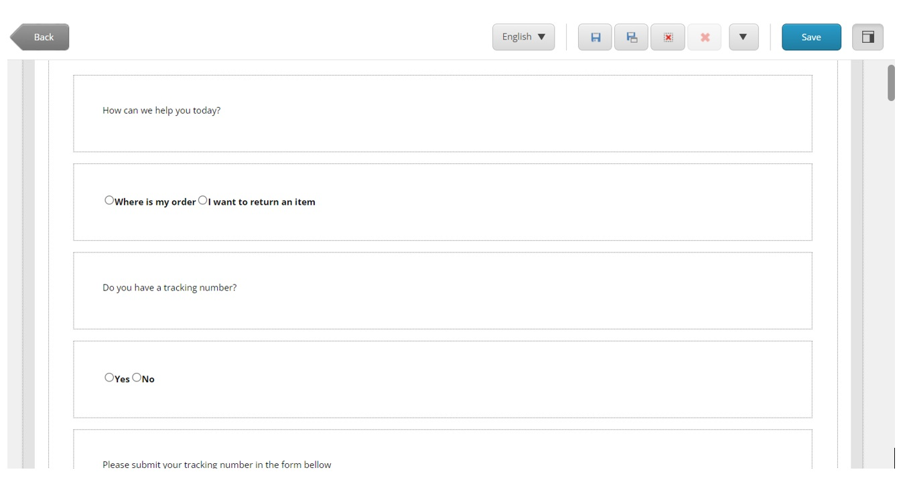
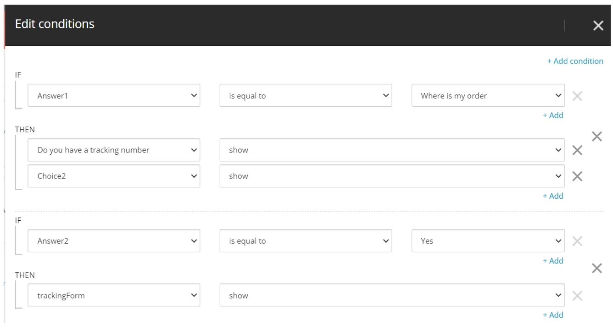
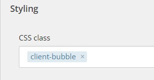
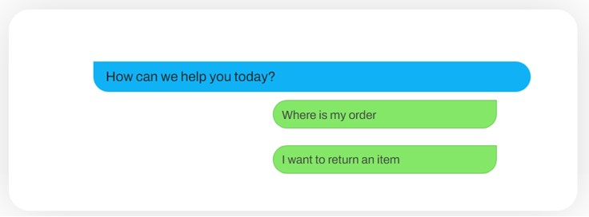
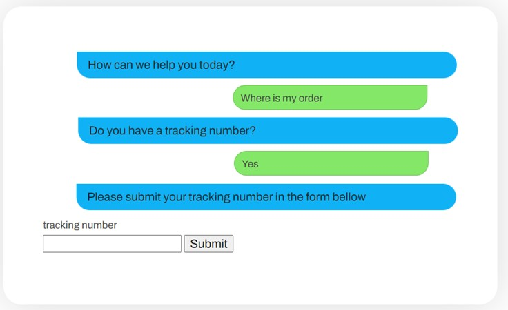

## Sitecore Forms - Simulate a Chatbot

Communication is key in establishing trust based and solid relations between provider and client. It is not surprising that companies have been investing more in creating new and innovative ways to interact with their customers and stay connected with them.

One increasing trend has been the use of chatbots or virtual assistants on websites: They can help the user on how to find a predefined question without the hurdle of going through a very extensive FAQ (Frequently Asked Questions) section. More importantly, it increases the sense of proximity and personalized service to customers by providing an immediate answer. Especially when compared to traditional forms where users must wait for the answer after submitting them.

Still, not everyone is completely convinced about the benefits and Return on Investment of this approach, which can indeed be expensive to acquire and implement. It's only natural for some companies to start with a lighter approach before investing fully in an Artificial Intelligence driven digital assistance.

Recently we had a request from a customer who was exactly in this very situation. They wanted to know if it would be possible to have an interactive FAQ section that, although it would not have any AI features, it would simulate a digital assistance chat. They would like to be able to create all the questions and answers and have them presented to the customer by means of an instant chat.

Sitecore can offer exactly this using good old Sitecore Forms. No backend coding is needed. Only apply some CSS to the Sitecore forms generated HTML. Answers, questions, and relations between them can be created and managed by content editors to quickly set up interactive FAQ sections that simulate a chatbot.

Bellow are the steps we took in implementing this feature.

# Create The Form Questions and Answers
We start by designing a form with all the possible pairs of questions and answers.

Tip: If the one form gets too big, we recommend splitting it into several smaller ones, contained in sections. You can then install the [Sitecore Forms Extension](https://sitecore-forms-extensions.readthedocs.io/en/latest/) that provide us with the submit action “navigate to section”. 

We used basic Text element for the questions and Radio Buttons List for the possible answers. An example of the raw look of the form can be seen on the picture bellow

# Using Sitecore Forms Conditions To Create Relationships And Define Navigation
Once the form is ready with all the questions and answers, we can then use the Sitecore Forms Conditions to display the next question based on the previous chosen answer from the user. This way we can guide the user into finding what he needs based on his input. Notice that we put every question and possible answers inside sections. This makes it easier to hide/show elements using Sitecore Forms Conditions.

For instance, in the example bellow, Answer1 is the Radio List with two options: “Where is my order” and “I want to return an item”. If the user selects the first, we will show the sections that contain the next question (“Do you have a tracking number") and the section containing the radio button list with the possible answers.

# Apply CSS To Make The Form Look Like An Instant Chat.
By applying some CSS to the Sitecore forms, we can easily make the form look like an instant chat (e.g., messenger or WhatsApp). In our case, we created specific CSS classes to render the texts and radio button lists as blue (bot) or green (client) bubbles. When designing the form, we can then assign elements with these classes accordingly using the Styling section of Sitecore forms.

Of course CSS can be used to style the forms in any other layout. The aim should be to increase the user’s sense of interaction and feeling of proximity with the website.

Here is an example of the initial state of the form, when the first question (in blue) and possible answers (in green) are displayed for the user to select.

And finally, how it looks like after the user has clicked his way through the chat. Only the selected answers are visible. And since we are using Sitecore Forms, the chat can end either with a simple text or even any custom submit action.

