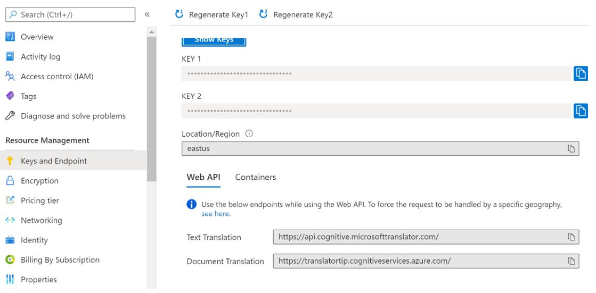
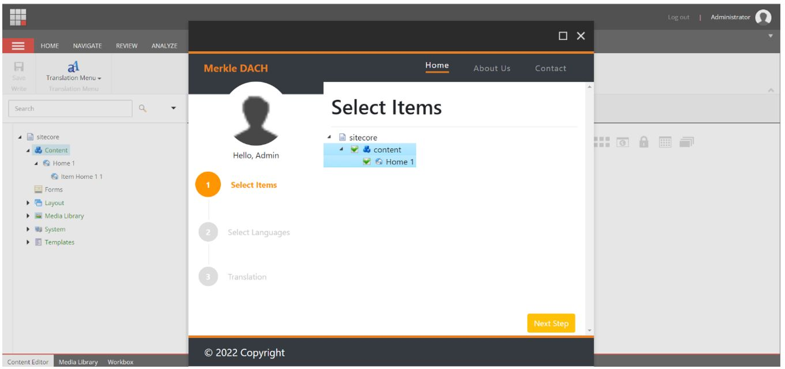
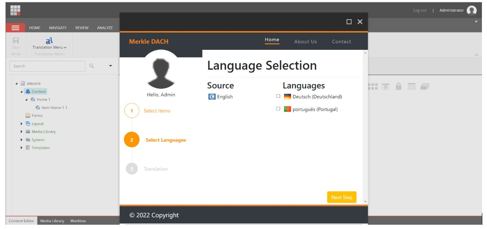

Sitecore is an excellent content management solution that enables users to create, edit, collaborate, publish, and store digital content. One of the most used and praised out of the box features is the multi-language support for content editing. This of course implies that content needs to be translated with internal or external client resources.  

The market provides some excellent human translation services that integrate directly with Sitecore to facilitate this task. But with the evolution of computing power and AI (Artificial Intelligence) technology, we have reached a point where machine translations have enough quality to be also considered given that also have other very interesting advantages.  

*	Speed and volume – Machine Translation can translate millions of words almost instantaneously, while continually improving as more content is translated. 

*	Large language selection – The biggest providers can offer automatic translation for 50 or even more languages. 

*	Reduced costs – Machine Translation can cut costs and time to deliver translations by supplying basic but useful translations. Then the human translators can then refine these versions to reflect the original intent of the content and ensure proper localization per region more closely.
 
In this blog post, our goal is to describe a possible solution to have Sitecore content automatically translated without having to leave Sitecore backend for the convenience of the content editors. 

# Step 1 - Create a Translator resource 

We will start by creating a Translator resource. For this post’s purpose, we decided to go with Microsoft Azure Cognitive Services because it is easy to create, well documented and can be tested without any costs as Microsoft allows translations up to 2M characters per month free of charge.  

To create a Translation resource is also quite straightforward: 
1. Go to the Azure Portal
2. Click the <strong>Create a resource</strong> button (the plus-sign in the top left corner) 
3. Search for <strong>Translator</strong>, select the "Translator" result and click <strong>Create</strong> 
4. Create or Select a <strong>Resource Group</strong>.
5. Fill in a <strong>“Name”</strong>.
6. Select a <strong>“Pricing tier”</strong>. The <strong>"Free F0"</strong> tier is fine for testing. 
7. Click <strong>“Review + create”</strong> and then <strong>Create</strong>

After the translator resource is created, we need to get the connection details. We will need them to call the translation service from code later.
1.	Navigate to the Translator resource in the Azure portal
2.	Click on the <strong>Keys and Endpoint</strong> menu
3.	Copy the <strong>Key</strong> (Any of the two generated will do) , the <strong>Location/Region</strong> and <strong>TextTranslation</strong>  URL of the Web API. 

# Step 2 - UI To Manage Translations inside Sitecore’s backend
One of the coolest aspects about Sitecore XP, is that it’s quite flexible when it comes to extending and customizing its features. To guide the content editors through the translation process we decided to create a custom Sitecore command and button that opens a SPEAK UI dialog. 
SPEAK allows us to quickly create an HTML5/CSS3 based UI to collect all the data from the content editors that is needed   to perform the automatics translations. You can read more about SPEAK and how to create SPEAK pages here on Sitecore’s official documentation [link](https://doc.sitecore.com/xp/en/developers/speak/90/speak/open-a-speak-dialog.html) and how to add custom Sitecore buttons to the Content Editor [here](https://community.sitecore.com/community?id=community_blog&sys_id=71e267211bc370d0b8954371b24bcbdb)

Our SPEAK Dialogue will consist of 3 parts
1. Select items to translate
2. Select source and target languages
3. Translation result and report

On part one we present the content tree for the user to select the item to translate. We will then pick up all the custom text fields of the selected items.

On the second part we display as source the languages where the selected items already have a version (English for the example we show below). All the other languages that are configured to be supported and don’t have a translation yet, show as selectable. The process will create a version for every selected language to store the output of the automatic translation.

Finally, the last part shows the result of the translation and summarizes each item and field that has been processed.

# Step 3 - Process the machine translations
Now that we have our Translator resource on the Azure portal and a UI to collect translation requirements from the content editors, we have everything we need to start translating content automatically from the Sitecore backend.

Requesting a translation is quite simple. We simply need to post a request to the Microsoft Cognitive Services Translation web API using the authentication  Key we got on Step 1 and supplying the content, source language and target languages as parameters we collected on Step 2 through our SPEAK UI. 

Here is an example of a request to translate a text from English to German and French in one single request. Microsoft has the process well documented with all supported options and details here [link](https://learn.microsoft.com/en-us/azure/cognitive-services/translator/reference/v3-0-translate#translate-to-multiple-languages)


curl -X POST "https://api.cognitive.microsofttranslator.com/translate?api-version=3.0&from=en&to=de&to=fr" -H "Ocp-Apim-Subscription-Key: <client-secret>" -H "Content-Type: application/json; charset=UTF-8" -d "[{'Text':'Some text stored in Sitecore’}]"


And the result will come in the following format:


[
    {
        "translations":[
            {"text":"Du texte stocké dans Sitecore","to":"fr"},
            {"text":"Einige in Sitecore gespeicherte Texte","to":"de"}
        ]
    }
]


Next step is to deserialize this and create the item’s new language version to store the generated translations. In our approach we stored the result of the translation in a TranslationResult class and passed it as a parameter to a method that creates the new item versions.


private static Item CreateItemVersion(this Item item, IEnumerable<Field> fieldToTranslate, TranslationResult[] translationResult, bool isToCreateNewVersion = false)
{
	item.Editing.BeginEdit();
 
	if (isToCreateNewVersion)
		item.Versions.AddVersion();
	else
	{
		if (item.Versions.Count == 0)
			item.Versions.AddVersion();
	}
 
	for (int i = 0; i < fieldToTranslate.Count(); i++)
	{
		item.Fields[fieldToTranslate.ElementAt(i).ID].Value = translationResult.GetTranslatedValue(i, item.Language);
	}
 
	item.Editing.EndEdit();
	return item;
}



The approach that we just described is just one possible integration. Instead of creating the SPEAK UI that gives the content editor more control on what to translate. As an alternative we could, for example, have just extended Sitecore’s Save or Publish pipelines to take care of all translation upon these events. But the bottom line is that integrating machine translations into Sitecore’s backend for the content editor’s convenience is something that requires little effort and considerable benefits. This is also a solution that should be quite easy to isolate and make it reusable across many projects.