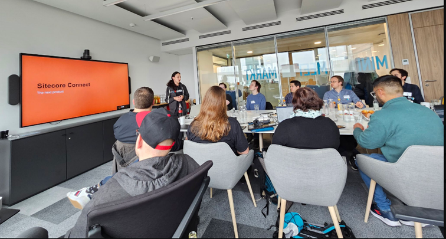

# Sitecore Usergroup Germany meetup in Frankfurt

On May 11th, twenty-three Sitecore enthusiasts from near and far – even Budapest :O – came together at our Merkle Frankfurt office to talk about their favorite topic: Sitecore.

Apart from meeting old and new friends, sharing stories and experiences, and enjoying some great company and food - thanks to the SUGDE organizers :), we had a packed agenda to fill the afternoon.

## SUGCON Europe Summary

I had the pleasure of opening with the first presentation, giving a short summary of the topics and talks from the last SUGCON in Malaga.

Without going too deep into detail, I want to say that it’s nice to see, what the community has achieved with all the new tools Sitecore has provided in the last few months. On the other hand, it’s also nice from Sitecore to not announce any new products and give us some time to catch up with their rapidly growing portfolio.

Keep an eye open for the [recordings from SUGCON](https://www.youtube.com/c/SUGCON). They will be worth your time.

## Next Step Disaster Recovery: Terraform and Azure

Next up was Marcello Pabst, who gave a great introduction to infrastructure as code and a deep dive into Terraform and Azure.
He explained the benefits of infrastructure as code, such as reliability and faster recovery, as opposed to maintaining infrastructure manually.

We also got a live demo of the actual implementation of a Terraform project and how to run automated test against your infrastructure with [checkov](https://www.checkov.io/).

Finally, Marcello gave some great examples of quirky edge cases and pitfalls especially for the Azure platform which showed that [Terraform](https://www.terraform.io/) is a great tool to help you set up infrastructure but does not replace experience or knowledge of your target platform.

## Sitecore Connect: the next product

The third presentation was an introduction to Sitecore Connect by Anna Bründel.

First, she gave an overview of all the new terms that come with Sitecore Connect, which helped me a lot in making more sense of the product. However, I will surely need a couple of rereads of the documentation to memorize the complete terminology. :)

But by far the most interesting part was seeing Sitecore Connect in action. Anna presented her PoC on how she connected an Order Cloud shop to an order fulfillment tool, which included bidirectional communication between both systems. She showed how a custom connection can be added to Sitecore Connect.

Adding to this demo, Christian Hahn then presented some more complex workflows with Sitecore Connect, also with a live demo of how he implemented a comment section moderation tool that automatically flags and reports harmful comments by integrating Open AI via Sitecore Connect.

## XM Cloud Components in Action

And last but definitely not least was Sebastian Winter with his presentation on XM Cloud Components.

The tool is currently in the early access phase, so it was awesome to see some hands-on live demos, of which we got a lot thankfully.

Components will give marketers the power to easily create new components to use in XM Cloud, without the need to write any code. The creation process looked very simple, and in a few clicks, we saw how a hero component was put together. I am looking forward to getting some firsthand experience with this feature as soon as it is released.

## Wrapup
All in all, it was a fantastic day. I learned a lot, and I especially enjoyed meeting so many people from across or even beyond the country.

Again, a big thank you to the SUGDE organizers for bringing us all together, and until next time.

