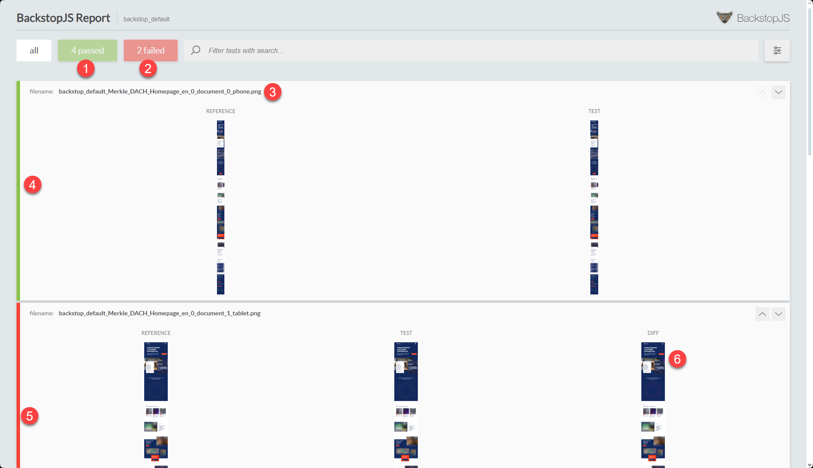
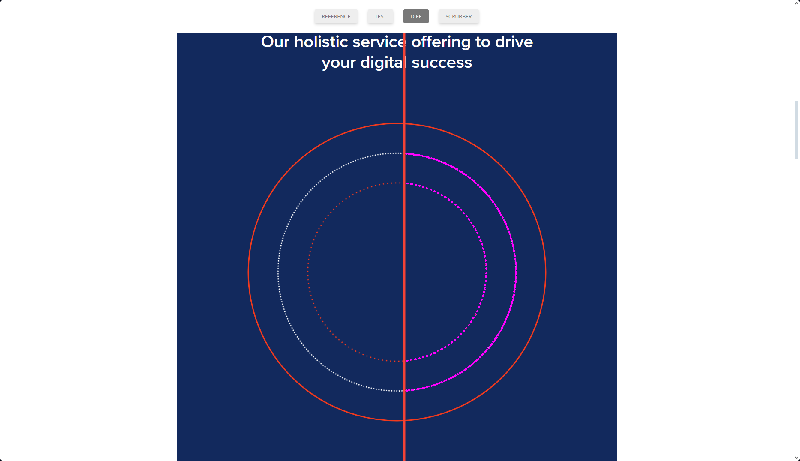

Photo by <a href="https://www.pexels.com/@pixabay/">Pixabay</a> on <a href="https://www.pexels.com/photo/abstract-bright-close-up-color-268460">Pexels</a>

## Introduction
Are you annoyed by unrecognized UI changes? Are you still wasting time making sure your changes are not crashing something? Use BackstopJS as an option to improve your regression testing process locally and in your CI/CD process. We tried it out and developed this application that now makes our lives easier.

## Usage of BackstopJS
BackstopJS runs through a predefined list of pages on a website, takes screenshots, and compares these screenshots to highlight any changes. It can be run locally and can be easily integrated into a pipeline.

# Local usage

## Installation
Open a command prompt and type the following command, to install BackstopJS globally:


npm install -g backstopjs


After installing, you have to close your command prompt and reopen it, so you can use the ```backstop``` commands.

## Initialization
First, you have to initialize Backstop. This command will create all the files you need for the test run later.


backstop init


## Adding pages
The pages are configured in the generated ```backstop.json``` file. You can add your pages as ```scenarios``` in that JSON file. It is also advisable to adjust the ```delay``` to give the tool some time before the screenshot is taken so that the page with images has loaded completely.


"scenarios": [
    {
      "label": "Merkle DACH Homepage en",
      "cookiePath": "backstop_data/engine_scripts/cookies.json",
      "url": "https://www.merkle.com/dach/en",
      "referenceUrl": "",
      "readyEvent": "",
      "readySelector": "",
      "delay": 300,
      "hideSelectors": [],
      "removeSelectors": [],
      "hoverSelector": "",
      "clickSelector": "",
      "postInteractionWait": 0,
      "selectors": [],
      "selectorExpansion": true,
      "expect": 0,
      "misMatchThreshold" : 0.1,
      "requireSameDimensions": true
    },
    {
      "label": "Merkle DACH Homepage de",
      "cookiePath": "backstop_data/engine_scripts/cookies.json",
      "url": "https://www.merkle.com/dach/de",
      "referenceUrl": "",
      "readyEvent": "",
      "readySelector": "",
      "delay": 300,
      "hideSelectors": [],
      "removeSelectors": [],
      "hoverSelector": "",
      "clickSelector": "",
      "postInteractionWait": 0,
      "selectors": [],
      "selectorExpansion": true,
      "expect": 0,
      "misMatchThreshold" : 0.1,
      "requireSameDimensions": true
    }


## Cookies configuration
Most websites have a cookie-consent overlay that blocks large parts of the page. To prevent this from appearing on the screenshots, there is the ```cookies.json``` file, which was generated under the path ```.\backstop_data\engine_scripts``` by the Init command. Update the file with the cookie values of your test page.


[
  {
    "domain": "www.merkle.com",
    "path": "/",
    "name": "OptanonAlertBoxClosed",
    "value": "2023-12-06T00:00:00.000Z",
    "expirationDate": 1798790400,
    "hostOnly": false,
    "httpOnly": false,
    "secure": false,
    "session": false,
    "sameSite": "Lax"
  }
]


## Adding a resolution
To test different resolutions and thus devices, you can create as many entries as you like in the ```backstop.json``` file under the ```viewports``` array.


"viewports": [
    {
      "label": "phone",
      "width": 320,
      "height": 480
    },
    {
      "label": "tablet",
      "width": 1024,
      "height": 768
    },
    {
      "label": "desktop",
      "width": 1920,
      "height": 1080
    }
  ],


## Initial run
You need to make an initial run so that you have screenshots for later comparison.


backstop test


This creates a folder with the screenshots under ```.\backstop_data\bitmaps_test```

## Approve
After the screenshots have been taken, the status must be approved and used as a reference for the subsequent screenshots.


backstop approve


## Test run
With a new ```test``` command, the previously created screenshots are compared with new ones and an analysis is made.


backstop test


## Interactive test report
After the test has been run, the ```index.html``` from ```.\backstop_data\html_report``` is opened and the results are visible. 



1.  4 tests passed
2.  2 tests have failed
3.  First defined entry "Merkle DACH Homepage en" with "phone" resolution
4.  Green bar for passed tests
5.  Red bar for failed tests
6.  Diff with errors marked (click on it)



The magenta colored areas show the difference between the screenshots. In this case, the dots were slightly shifted and can be ignored. You can slide the vertical line to see the difference between the reference and test image.

# Integration to Azure DevOps Pipeline

## Prerequisites

### Include configs in your repository
Before you change the pipeline, you must check in the config files created and customized by BackstopJS in the repository.

### Set tokens to replace later
If you have several environments that are to be tested, it makes sense to use a configuration file in which the URL is defined as a token that can be replaced for different stages. Here we defined ```$(Target.WebsiteUrl)``` that will be replaced by ```https://www.merkle.com/```, but it could also be something like ```https://www.dev.merkle.com```.


"scenarios": [
    {
      "label": "Merkle DACH Homepage en",
      "cookiePath": "backstop_data/engine_scripts/cookies.json",
      "url": "$(Target.WebsiteUrl)/dach/en",
      "referenceUrl": "",
      "readyEvent": "",
      "readySelector": "",
      "delay": 300,
      "hideSelectors": [],
      "removeSelectors": [],
      "hoverSelector": "",
      "clickSelector": "",
      "postInteractionWait": 0,
      "selectors": [],
      "selectorExpansion": true,
      "expect": 0,
      "misMatchThreshold" : 0.1,
      "requireSameDimensions": true
    },


### Create a storage
In order to store the test results somewhere, a storage must first be created, e.g. an Azure Blob Storage can be used for this.

## Steps on Azure DevOps

### Set variable CurrentDateTime
Unfortunately, there is no variable like a timestamp that we could use to add to the file name when we archive the backstop data. Therefore, we added a variable called ```CurrentDateTime```, which we set in the ```Set CurrentDateTime``` step. The script looks as follows:


steps:
- powershell: |
   $dateStr = (Get-Date).ToString('yyyy-MM-dd-hh-mm-ss')
   Write-Output "##vso[task.setvariable variable=CurrentDateTime;]$dateStr"
    
  displayName: 'Set CurrentDateTime'


### Define BackstopConfig path
Add a variable with the name ```BackstopConfig``` and set it to the path of the checked-in file ```backstop.json```.

### Replace tokens
Use the task [Replace token](https://github.com/colindembovsky/cols-agent-tasks/tree/main/Tasks/ReplaceTokens) to replace the website URL. In this case, ```Target.WebsiteUrl``` is a variable defined in the pipeline. The step could look like this:


steps:
- task: colinsalmcorner.colinsalmcorner-buildtasks.replace-tokens-task.ReplaceTokens@1
  displayName: 'Replace tokens in Backstop config'
  inputs:
    sourcePath: '$(System.DefaultWorkingDirectory)/_WebsiteFiles'
    filePattern: backstop.json
    tokenRegex: '\$\((.+)\)'


### Install NodeJS
Use the [Node.js tool installer](https://learn.microsoft.com/en-us/azure/devops/pipelines/tasks/reference/node-tool-v0?view=azure-pipelines) and install version 14.x


steps:
- task: NodeTool@0
  displayName: 'Install Node.js'
  inputs:
    versionSpec: 14.x


### Install BackstopJS
Install BackstopJS using the [Command line task](https://learn.microsoft.com/en-us/azure/devops/pipelines/tasks/reference/cmd-line-v2?view=azure-pipelines&viewFallbackFrom=azure-devops)


steps:
- script: 'npm install -g backstopjs'
  workingDirectory: '$(System.DefaultWorkingDirectory)/_WebsiteFiles'
  displayName: 'Install BackstopJS'


### Init BackstopJS
Use again the Command line task and run the following command


call backstop test --config="$(BackstopConfig)"
call backstop approve


### Deploy your app
Now you have to deploy your web app and warm up your cd instance.

### Test BackstopJS
Run the test and make sure that a failed test does not cause the pipeline to stop. Since BackstopJS will most likely return some false positives, this could lead to an unwanted stop of the pipeline. Set ```continueOnError: true```.


variables:
  BackstopConfig: '"$(System.DefaultWorkingDirectory)/_WebsiteFiles/backstop.json"'
 
steps:
- script: 'call backstop test --config="$(BackstopConfig)"'
  workingDirectory: '$(System.DefaultWorkingDirectory)/_WebsiteFiles'
  displayName: 'Test BackstopJS'
  continueOnError: true


### Archive Backstop Data
You can archive the entire ```backstop_data``` folder so that you can upload it to a storage such as Azure Blob Storage.


steps:
- task: ArchiveFiles@2
  displayName: 'Archive Backstop Data'
  inputs:
    rootFolderOrFile: '$(System.DefaultWorkingDirectory)/_WebsiteFiles/backstop_data'
    archiveFile: '$(System.DefaultWorkingDirectory)/_WebsiteFiles/backstop_data_$(CurrentDateTime).zip'
  condition: succeededOrFailed()


### Upload it to Azure
You can use [Azure File Copy](https://github.com/microsoft/azure-pipelines-tasks/blob/master/Tasks/AzureFileCopyV1/README.md) to upload the archive to storage on Azure


steps:
- task: AzureFileCopy@3
  displayName: 'Upload Backstop Data to Azure'
  inputs:
    SourcePath: '$(System.DefaultWorkingDirectory)/_WebsiteFiles/backstop_data_$(CurrentDateTime).zip'
    azureSubscription: 'YOUR_SUBSCRIPTION'
    Destination: AzureBlob
    storage: yourstorage
    ContainerName: BackstopTestingResults
    BlobPrefix: 'ENVIRONMENT $(Build.BuildNumber)'
    sasTokenTimeOutInMinutes: 240
  condition: succeededOrFailed()


### Check your logs and test results
After each deployment, the developers can look specifically at the BackstopJS logs from the pipeline and see if there are any failed tests. If this is the case, the test results can be downloaded as a zip file, unpacked and analyzed.

## Conclusion
In our experience, there are often false positives, so the tool should not be used as a 100% reliable test tool. Nevertheless, it saves a lot of testing effort if several dozen pages are checked automatically and only those from the error messages need to be checked manually.
