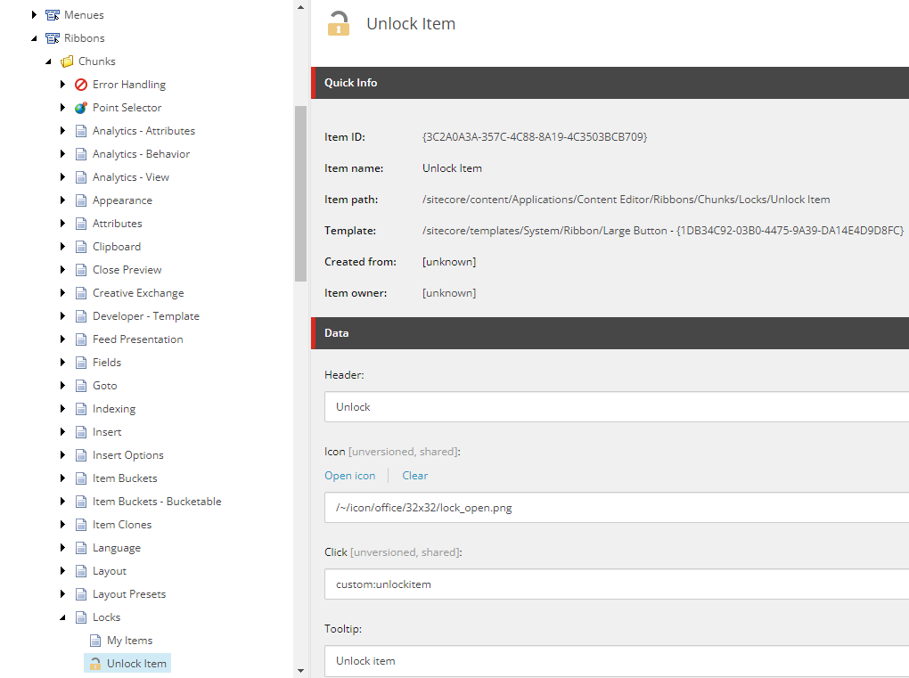
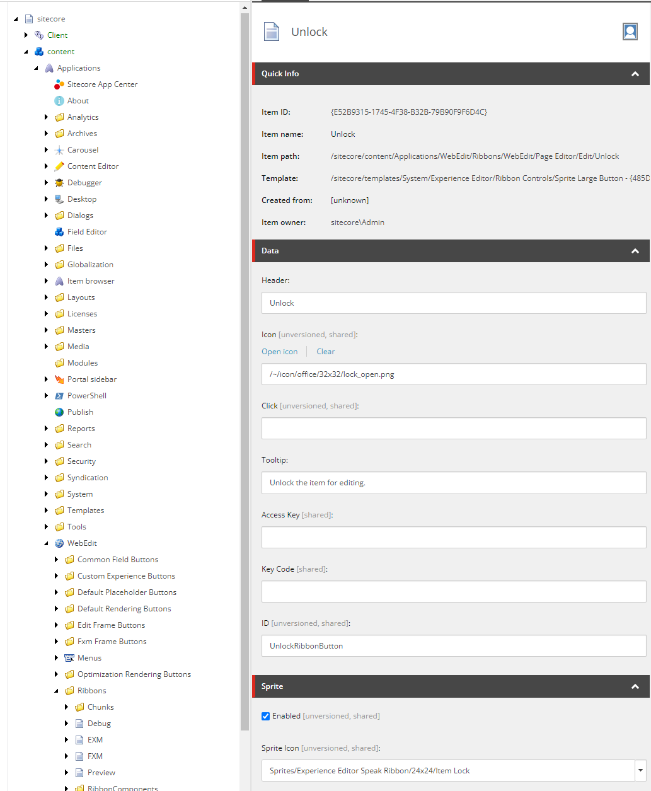
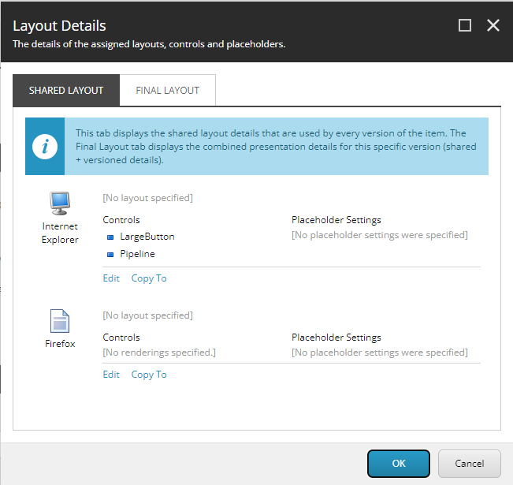
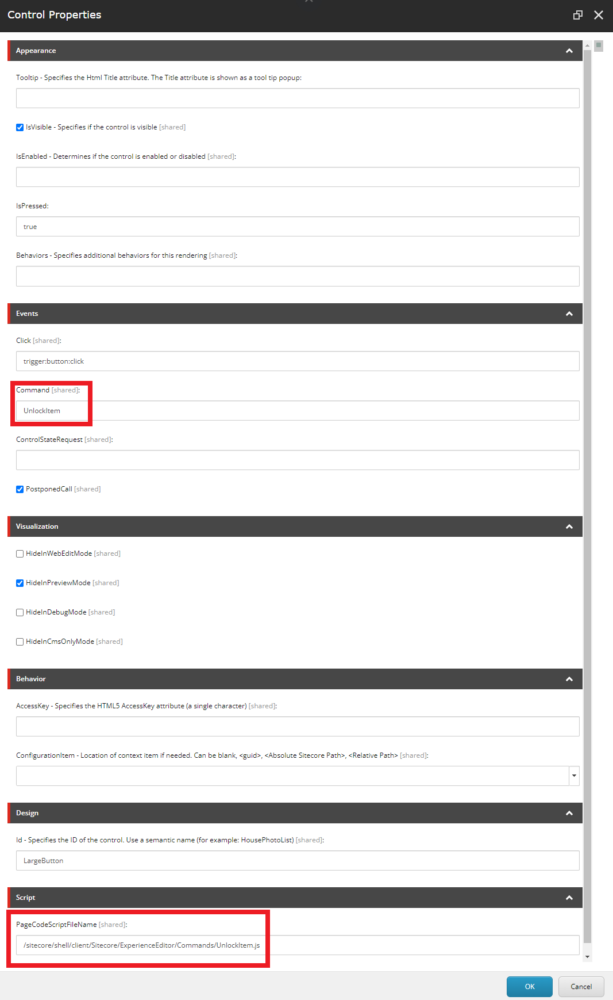

# How to add a custom unlock button to the Content and Experience Editor

Most Sitecore developers know this request already.

> We do not want everyone to be an admin, but editors should still be able to release the editing lock in case a colleague is on leave and has an item locked.

Because this is a recurring request, I have seen on multiple projects by now, I wanted to write down this step-by-step guide, how to add a custom unlock button to the Content Editor as well as the Experience Editor. I assessed this solution on Sitecore version 9.3.

## The challenges

First challenge is, that the unlock functionalities, which come with Sitecore out of the box are only usable by administrators and it is not possible, to make them available by making changes within the Security Editor in Sitecore.

Second challenge is, that the UIs of the Content Editor and Experience Editor are implemented in two separate ways, so we need to customize our solution according to the different contexts.

These challenges we can overcome with the following three steps:

## Step 1 - Create an unlock item command

The first step is already well documented, e.g. here: [Sitecore Unlock Item Command](https://www.skillcore.net/sitecore/sitecore-unlock-item-command)

In our Visual Studio project, we add a new command:


using Sitecore.Shell.Framework.Commands;

namespace MyProject.Commands
{
    public class UnlockItem : Command
    {
        public override void Execute(CommandContext context)
        {
            if (context.Items.Length != 1)
                return;

            var item = context.Items[0];
            if (item.Locking.IsLocked() && item.Access.CanWrite())
            {
                using (new Sitecore.Security.Accounts.UserSwitcher(@"sitecore\itemUnlocker", false))
                {
                    item.Locking.Unlock();
                }
            }
        }

        public override CommandState QueryState(CommandContext context)
        {
            if (context.Items.Length != 1)
                return CommandState.Hidden;

            var item = context.Items[0];

            if (!item.Locking.IsLocked() || !item.Access.CanWrite())
                return CommandState.Hidden;

            return base.QueryState(context);
        }
    }
}



and we register it in a config file:



<configuration xmlns:patch="http://www.sitecore.net/xmlconfig/" xmlns:set="http://www.sitecore.net/xmlconfig/set/"
               xmlns:role="http://www.sitecore.net/xmlconfig/role/">
    <sitecore>
        <commands>
            <command name="custom:unlockitem" type="MyProject.Commands.UnlockItem, MyProject" />
        </commands>
    </sitecore>
</configuration>



With the command in place now, we can continue to make it available to the authors.

## Step 2 - Add an unlock button to the Content Editor

For the Content Editor, we simply add a new button item to one of the Ribbon Chunks of the Content Editor.

First, we must switch to the **core** database and navigate to the "Locks" chunk under */sitecore/content/Applications/Content Editor/Ribbons/Chunks/Locks*.

There we add a new item with the following contents:

Now we already have the unlock button for the Content Editor finished. The only thing left is to add a similar button to the Experience Editor.

## Step 3 - Add an unlock button to the Experience Editor

Because the Experience Editor is based on Speak UI, the steps to add the unlock button are different here.

Luckily, I found this 14-year-old blog post, [how to run Commands from Experience Editor buttons](https://community.sitecore.com/community?id=community_blog&sys_id=edb2276d1b8370d0b8954371b24bcb86), that we can utilize to execute our unlock command from the Experience Editor.

First, we create a new button again in the **core** database. Within the folder */sitecore/content/Applications/WebEdit/Ribbons/WebEdit/Page Editor/Edit/Unlock* we duplicate the item called "Lock" and name it "Unlock". By duplicating the existing button, we do not have to completely recreate the presentation details.

We configure the button like this:

Next, we open the "Presentation Details" and click on the LargeButton rendering:

The Control Properties of the LargeButton we change according to this:

Take note of the path in "PageCodeScriptFileName": */sitecore/shell/client/Sitecore/ExperienceEditor/Commands/UnlockItem.js* and the "Command": *UnlockItem*.

Next, we will create the script, which is triggered, by clicking the button in the Experience Editor.

Within the command we can utilize the **scForm** object to invoke the command, that we created in step 1.

In our solution we create a new JavaScript file under the same path, that we configured previously in the Control Properties: */sitecore/shell/client/Sitecore/ExperienceEditor/Commands/UnlockItem.js*.



define(["sitecore"], function (Sitecore) {
    Sitecore.Commands.UnlockItem =
    {
        canExecute: function (context) {
            // Determines whether command is disabled or enabled.
            // For the purpose of this post we ignore this check
            return true;
        },
        execute: function (context) {
            scForm.invoke("custom:unlockitem");
        }
    };
});



Notice, that the **Sitecore.Commands.UnlockItem** name matches the "Command" field from the Control Properties of the unlock button.

## Step 4 - Enjoy your newly won flexibility :-)

Now we have the unlock button available both in the Content Editor as well as the Experience Editor.

I recommend introducing an additional role, that users require to see this button. This way we can easily configure, which users should have the ability to just unlock any arbitrary item within the CMS.

Image by <a href="https://pixabay.com/users/succo-96729/?utm_source=link-attribution&utm_medium=referral&utm_campaign=image&utm_content=628703">succo</a> from <a href="https://pixabay.com//?utm_source=link-attribution&utm_medium=referral&utm_campaign=image&utm_content=628703">Pixabay</a>
  

