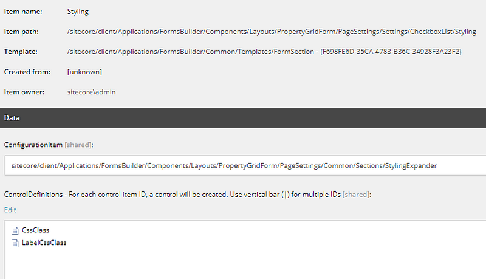

  

Like many others after upgrading from Sitecore 9.1 to Sitecore 10.3, we faced with bugs and some features stopped working for us. In this post I will try to list some of them and explain how we fixed them.

## Problem: Sitecore forms list fields stopped showing values of list items on local languages

We use local languages and they have fallback to main languages. Such as; en-gb to en, de-de to de.

We realized after the upgrade, any field that is based on list fields started showing item names on these local languages instead of translated ones for them. So we opened a ticket to Sitecore Support and ask for a solution. Sitecore Support registered this behavior as a bug in their bug tracking system and gave us a reference number 602361 for tracking.

## Solution
As a workaround they suggested either not use fallback mechanism on form fields and create versions on local languages or use ListDataSourceProvider from Sitecore 9.

We went with second option as we had many forms on many languages. So we patched Sitecore 9 ListDataSourceProvider over Sitecore 10:


public class ListDataSourceProvider : IListDataSourceProvider
    {
        private readonly IFormBuilderContext _formBuilderContext;
        private readonly IListItemParser _listItemParser;

        public ListDataSourceProvider(
            IFormBuilderContext formBuilderContext,
            IListItemParser listItemParser)
        {
            Assert.ArgumentNotNull((object)formBuilderContext, nameof(formBuilderContext));
            Assert.ArgumentNotNull((object)listItemParser, nameof(listItemParser));
            this._formBuilderContext = formBuilderContext;
            this._listItemParser = listItemParser;
        }

        public virtual IEnumerable<ListFieldItem> GetListItems(
            string dataSource,
            string displayFieldName,
            string valueFieldName,
            string defaultSelection)
        {
            List<ListFieldItem> listItems = new List<ListFieldItem>();
            IEnumerable<Item> dataItems = this.GetDataItems(dataSource);
            string[] strArray;
            if (defaultSelection == null)
                strArray = (string[])null;
            else
                strArray = defaultSelection.Split('|');
            string[] source = strArray;
            foreach (Item obj in dataItems)
            {
                ListFieldItem listFieldItem = this._listItemParser.Parse(obj, displayFieldName, valueFieldName);
                if (!string.IsNullOrEmpty(listFieldItem.Value))
                {
                    listFieldItem.Selected = source != null && ((IEnumerable<string>)source).Contains<string>(listFieldItem.ItemId);
                    listItems.Add(listFieldItem);
                }
            }
            return (IEnumerable<ListFieldItem>)listItems;
        }

        public virtual IEnumerable<Item> GetDataItems(string dataSource)
        {
            Item obj = !string.IsNullOrEmpty(dataSource) ? this._formBuilderContext.Database.GetItem(dataSource, this._formBuilderContext.Language) : (Item)null;
            return (IEnumerable<Item>)((obj != null ? obj.Children.ToList<Item>() : (List<Item>)null) ?? new List<Item>());
        }
    }




<?xml version="1.0" encoding="utf-8"?>
<configuration xmlns:patch="http://www.sitecore.net/xmlconfig/" xmlns:role="http://www.sitecore.net/xmlconfig/role/">
 <sitecore role:require="Standalone or ContentManagement or ContentDelivery">
  <services>
   <register patch:instead="*[@serviceType='Sitecore.ExperienceForms.Mvc.DataSource.IListDataSourceProvider, Sitecore.ExperienceForms.Mvc']" serviceType="Sitecore.ExperienceForms.Mvc.DataSource.IListDataSourceProvider, Sitecore.ExperienceForms.Mvc" implementationType="ProjectName.Foundation.Forms.ExperienceForms.Mvc.DataSource.ListDataSourceProvider, ProjectName.Foundation.Forms" lifetime="Transient" />
  </services>
 </sitecore>
</configuration>



## Similar Problem: Form submissions not working on local languages
On our website, we use custom submit actions to make API requests. These API requests rely on datasource items selected on Sitecore. After some testing, we realized that some fields on these datasource items have empty values sent to API even though they were filled on main languages on Sitecore. So Sitecore was not able to fill these values that are supposed to come from fallback language.

## Solution

After opening another Sitecore support ticket, we realized that Enable item language fallback and Enable field language fallback checkboxes were not checked on site items. In Sitecore 9 version, there was no checkbox and we were using Other Properties field. That's why the problem occurred. You can check the following documentation from Sitecore here
[link](https://doc.sitecore.com/xp/en/developers/sxa/103/sitecore-experience-accelerator/enable-language-fallback-for-sxa-sites.html)

For these 2 problems thank you for your support Arun Tiwari..

## Problem: Form field classes not rendered

After the upgrade, all of our forms were not showing css classes. Since they are added to the project for custom implementations, they were not changed by upgrade automatically.

## Solution
In Sitecore 9, Model.CssClass for fields and Model.LabelCssClass for labels were used. These properties become obsolete in Sitecore, so we needed to use Model.CssClassSettings.CssClass and Model.LabelCssClassSettings.CssClass respectively. After these changes forms were rendering css classes again.

## Similar Problem: Forms Editor not showing Styling section on custom form fields

In Sitecore 10, there was another change for each form field on core database. Sitecore started using new CssClass and LabelCssClass items on Styling item:

## Solution

Even though item names are same, there are different items selected in Sitecore 10. You can put the following ids on ControlDefinitions field on Sitecore for each of these custom fields, then we will be able to see css classes on Sitecore Forms Editor:

*{98FB361E-3A7F-49F9–8789–8C169FB95B61}|{121B9875–2F7D-4D62-BD0F-35A7B909ECE8}*

## Problem: Missing field values after Glass mapper upgrade

After the upgrade, we realized there were many field values not showing on website. All of these fields had one thing in common. Their properties did not have setters on class entities. But all of them were working fine before the upgrade.

## Solution

We searched on glass mapper documentation found this one:
[glass mapper](http://www.glass.lu/Mapper/Releases.html) on version 5.3.17 which mentions:

>ISSUE 370 The lazy object inceptor will now ignore class properties that don't have a setter or have the SitecoreIgnore attribute.

So, after upgrading glass mapper, checking if every property mapped with glass mapper has a setter is crucial. Especially, if you use them for API calls or search functionality.

## Problem: Custom Powershell scripts on Toolbar not working

In our project, we used powershell scripts to bulk edit workflow state, copy item version, reset field value and many more. We created these scripts and added them to Toolbar so our customer can use it too. But after the upgrade to Sitecore 10, we have seen that all of them were not clickable, showing just script names and blank icons.

## Solution 

After some investigation, we decided to rebuild all scripts on Powershell ISE. This rebuild created some changes on items. But mainly on items that represent each script on core database had a different type now:

>Spe.Client.Controls.ContentEditorRibbonPanel,Spe

*Before* they had the following value on type field:

>Cognifide.PowerShell.Client.Controls.ContentEditorRibbonPanel,Cognifide.PowerShell

So after we start using updated type, scripts become clickable and icons are showing again.

## Problem: Fast Queries Not Supported

Fast queries are depricated in Sitecore 10. It's suggested to use search index. In our case, we were using fast query to reach a setting item.

## Solution

We developed a custom SettingProvider and started using it instead of queries or search indexes.

## Problem: System.OutOfMemory Exception

After we switched to Sitecore 10 and started using the databases from production system, many developers in team experienced this exception. 

Either cm was unhealty or after some time it was becoming unhealty. When we check logs on docker or inspect container, we would always see this error popping up. Also, Sitecore system was too slow to work on.

## Solution

We first checked how much which container consumes when docker is started with following command:

>docker stats

Thanks to this command, we were able to see SQL server is using way more than usual. We have seen values like 10–20 GB. We tried changing mem-limit for each container to find the combination that works but that was barely enough. Sitecore was again too slow to work. We also tried deleting the whole data on preview database, since it was not needed on our locals, but that was also not enough.

Then we realized something golden. EventQueue and PublishQueue tables in master, web db had over 405k entries on them. So we started a cleanup using the following sql:


USE [Sitecore.Core]
DELETE FROM dbo.EventQueue
DELETE FROM dbo.PublishQueue
USE [Sitecore.Master]
DELETE FROM dbo.EventQueue
DELETE FROM dbo.PublishQueue
USE [Sitecore.Web]
DELETE FROM dbo.EventQueue
DELETE FROM dbo.PublishQueue


After this cleanup docker become really fast, we got rid of the exception.

Thanks to Fabian Geiger and Ramazan Yilmaz for their support..