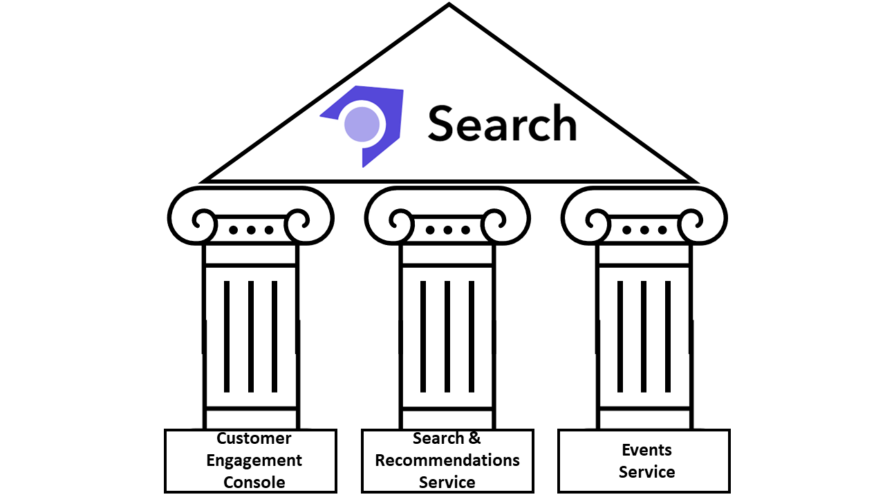
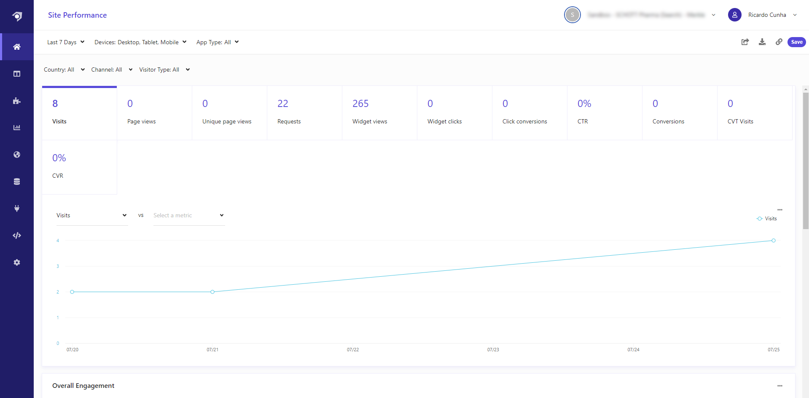
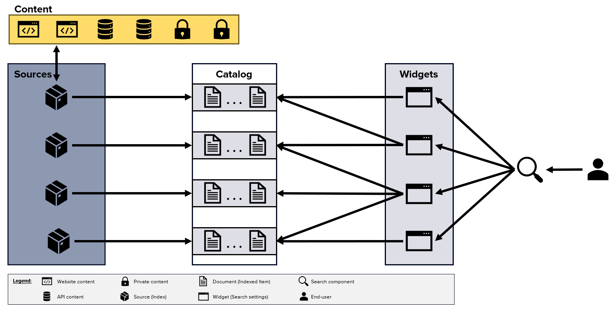
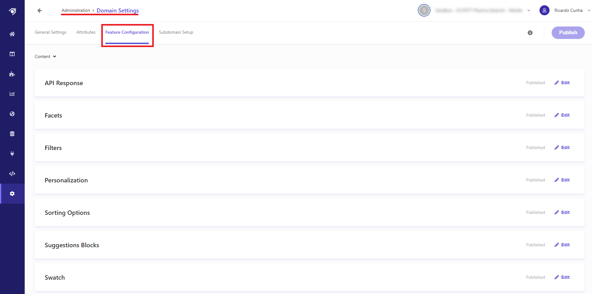

Foto from [Viarami](https://pixabay.com/users/viarami-13458823/) on [Unsplash](https://pixabay.com/photos/magnifying-glass-seek-detective-5232511/)

## What is Sitecore Search?
Released during last quarter of 2022, Sitecore Search is one of the most recent products from [Sitecore DXP offering](https://www.sitecore.com/products){:target="_blank"}. With the newly Sitecore Search product we are able to deliver relevant and personalized content to the right audience at the right time. It's a fully SaaS-based solution composed by three major pillars:
- **Customer Engagement Console (CEC)** - The Sitecore Search SaaS dashboard for search analytics, tests, configurations, and more.
- **Search & recommendations service** - An AI-based REST API for performing search queries and receiving results.
- **Event service** - A REST API for collecting visitor interactions which are key to optimizing the search experience.

    

The Customer Engagement Console (CEC) is Sitecore Search entry point, providing us with the right tools to manage, configure and analyze our search experiences. With CEC, we can create Sources, Widgets, rules, A/B tests, track analytics, test integrations and much more.

    

In current days, where companies are growing and improving their online presence, we are seeing data being fragmented across multiple systems. With Sitecore Search we are able to **integrate our website(s) or any online point of contact** to create engaging, and predictive **content search experiences across all our content sources**.

## Setup the Sitecore Search environment
While working with Sitecore Search we will mainly go through three major phases:

**1. Identify** - During the identification step we will need to analyze from where the content is about to be crawled/collected and decide how to store it inside Sitecore Search. Basically we should ask ourselves: how should the schema of our crawled content look like?

**2. Collect** - After deciding the places from where we are about to collect our data from, we should firstly create our sources and the needed document extractors, secondly add indexed documents to our Sitecore Search Catalog, and thirdly set the scan frequency for our sources.

**3. Configure** - During the configuration step we should start configuring all website search features we would like to provide to our customers. It's during this phase that we start configuring facets, sorting options, recommendations and widgets.

    

On Sitecore Search, each search experience provided to our customers is attached to a Widget which is represented in Sitecore Search as a unique ID named rfkid. Note that in Sitecore Search, widgets are not coupled with any visual representation. 
Instead, we can see them as configuration items that will be used on our search components. 

Widgets are a key concept on Sitecore Search, since it's from them that we can provide unique and custom experiences to our end users. For each widget we can configure different settings, such as pinning or blacklist results, choose which facets to display, boost certain indexed documents and much more.

In this blog post we will explain how to setup Sitecore Search environment, by exploring the following topics: 
1. Adding and configuring attributes. 
2. Adding and configuring sources. 
3. Configuring search features.

## Adding and configuring attributes
In Sitecore Search, attributes represent metadata of content items that we can use to generate suggestions, track metrics, filter search results, and so on.
Depending on the sources from which we are extracting content, some attribute fields may or may not be populated. **Mandatory attributes are the only ones we must collect on all existing sources**. Sitecore Search will not be able to index documents on sources for which mandatory attribute fields are missing. 

By default, Sitecore Search domain should come with some pre-built attributes such as: id, type, name, description, url or image_url.
The **id attribute** is an example of a **mandatory** attribute since each index document requires a unique identifier.

New attributes can be added under the **Administration → Domain Settings → Attributes** tab. On the attributes dashboard we just need to click on the "+ Add Attribute" button visible on the top right corner of the screen.

    

An important part of editing or adding an attribute is to configure the "Use for feature" options. In this menu of options we can decide which features of Sitecore Search the attribute can be used for.
For example, by selecting the "Suggestions Blocks" option the attribute field could be used to provide suggestions to end users.
The following list illustrates the possible feature options we can enable on each individual attribute:
- Facets
- Filter
- Personalization
- Search ranking
- Sorting Options
- Swatch
- Textual relevance
- Suggestions blocks

**Note:** In order to be able to add new attributes a **user should belong to the TechAdmin role**.

## Adding and configuring sources
In Sitecore Search, we can see sources as search indexes, each one configured to extract information from different locations such as public facing websites, private portals, etc, leading to the creation of several searchable indexed documents.
For each added source we need to configure how content will be crawled/extracted, by setting rules that will assign newly found content to the attributes that we previously defined. When configuring sources we can also set how frequently a source should run in order to update/create indexed documents (scan frequency).

### Source Connectors
Currently when creating a source we can choose one of the following connectors:
- **API Crawler** - This source type is used whenever the content can only be accessed by an API endpoint and the endpoint returns JSON.
- **API Push** - This can be useful whenever we need to have a source in which we need total control on how index items are added, deleted or updated. For this type of source we use the [Sitecore Search Ingestion API](https://doc.sitecore.com/search/en/developers/ingestion-api/index.html){:target="_blank"} that provide us the necessary methods to update existing indexed documents.
- **Web Crawler** - The basic crawler is useful when the content required to be indexed is available in just one locale/language, and only available thought HTML pages.
- **Web Crawler (Advanced)** - For more advanced use cases, where we would like to store data on different locales and languages, or just to have more configuration options.
                

### Create Source
To create a new source, we must go to Sources page and click on the "+ Add Source" button.
After that, we should give it a name, a description and choose which type of connector (from the ones described above) is most suitable for the newly created source.

    

 
 
### Configure Source
There are two key concepts we need to understand regarding sources:
- **Triggers** - These are the starting points that a crawler uses to look for content to be indexed. When starting the first data scan or rescan, Sitecore Search starts from the configured triggers.
- **Document extractors** - Group of rules that tell Sitecore Search how content should be extracted and to which attributes (index fields) it should be associated to.

An in depth explanation on how to configure a source can be seen on [Sitecore Search documentation page](https://doc.sitecore.com/search/en/developers/search-developer-guide/configuring-a-source.html){:target="_blank"}, however there are some key settings important to highlight:
- **Allowed domains** - It's an important setting to be defined, if no restrictions are applied to the allowed domains you may end by crawling pages that don't belong to the website search experience you would like to provide. For example you may have a link on one of your pages that points out to an external website and you may end up by adding their page under your index. You can prevent this from happening by properly setting the allowed domains of your source.
- **Max Depth** - Allow us to configure how deep our crawler will crawl our website pages. The crawler will start crawling content from the triggers we configure and will continue to follow links from our pages until it reaches the max depth defined in this setting. For example, with max depth of 3, the crawler would crawl until: trigger_page/level2/level3. The crawler does not open hyperlinks on the last page (level3) because it has reached the maximum depth of three.
- **Headers** - Provide us the possibility of adding custom headers to the requests our crawler will perform while trying to index content. This is an important feature since we can add some custom information mentioning that the requests are coming from our Sitecore Search bot crawler. This could be in hand so that we could tell our analytics dashboard to not show those page requests as page view's/counts. For example you can achieve this by adding the key/value pairs 'user-agent'/'sitecorebot' to your request headers and using that to filter your page views on your analytics dashboards.
- **Render JavaScript** - Be aware of this setting and how your page content is been load. For example, on cases for which you are looking for images pay attention to which attribute you are looking for, you may be looking to a "src" attribute which doesn't exists on page source and is only shown after lazy loading script was run. Other cases can be related with content been rendered in the page by using API calls (ex. list of articles).
- **Triggers options** - Depending on the type of source we are using, different types of triggers can be set. On an advanced web crawler we can select between sitemap, RSS, Request or JS triggers. From our investigation the one producing better results is the Sitemap trigger, since it clearly state the pages we need to crawl. For example when using a request trigger we may up by crawling a page of a third party website that we were not excluding when setting our allowed domains. It can also happen that with a request trigger, pages that are producing 404, 403 or 500 errors are been reached by the crawler which can prevent the crawler to properly finish his task.
- **Document extractors options** - We can extract content to be added to our attributes in different ways. Depending on which source type we are configuring we may choose between JS, CSS, Xpath or JSONPath extractors. The JS extractor makes use of Cheerio JS, a subset of jQuery implementation used to parse and manipulate HTML and XML. Before updating or running any JS document extractors, we may use [this cheerio testing website](https://scrapeninja.net/cheerio-sandbox/basic){:target="_blank"} which allow us to test our scripts against any HTML snippet.

## Configuring search features
While configuring attributes we can set to which Sitecore Search features they can be used for, however that doesn't mean those features will be automatically available whenever we configure a specific attribute. When configuring attributes, we are saying that a specific attribute can be used for a specific search feature (we are not configuring that feature on Sitecore Search).

**Note:** For facets and filters, no further configuration is needed. They are automatically available when we set attributes to be used as facets or filters. For other types of features like suggestions, sorting or textual relevance, further configurations are required.

In order to enable search features such as facets, sort options or suggestion, we need to navigate to the Feature Configuration panel located at: **Administration → Domain Settings → Feature Configurations**.

    

 

An example on how to configure search features like textual relevance, suggestions and sorting options can be seen in [this page](https://doc.sitecore.com/search/en/developers/search-developer-guide/walkthrough--configuring-search-features.html){:target="_blank"}.

After configuring all the necessary features, we can navigate to the Global Widget page under Global Resources section, and define the default facets, sorting options, textual relevance settings that by default all widgets will rely on.

Even though configurations were added to the global widget, Sitecore Search gives us the flexibility of changing them on each individual widget we have. These changes can even be done based on site or visitors context. For example we can have different configurations based on the country location from which the user is located at.

## Key Takeaways
- In a short period of time we can **quickly configure a powerful search platform**.
- Sitecore Search can provide customers with a **search experience that groups together content that is fragmented thought-out multiple sources** (global public website, shop website and APIs). With a single user query we can aggregate the results of all configured sources in a single data set that is returned to the user, enabling him to find content quickly and easily.
- Sitecore Search provides developers with an **existing API to get search results, facet options, suggestions, sorting options etc.** No need to create custom APIs, it's all provided by Sitecore Search.
- Sitecore provides a [Search JS SDK for react](https://www.npmjs.com/package/@sitecore-search/react){:target="_blank"} that we can use to accelerate the integration between Sitecore Search and your website.
- Coding wise, the effort needed to have this available in a website is mainly frontend code which can make use of existing [Sitecore Search rest APIs](https://doc.sitecore.com/search/en/developers/search-developer-guide/integrating-using-rest-apis.html){:target="_blank"} or using the new [Sitecore Search JS SDK](https://www.npmjs.com/package/@sitecore-search/react){:target="_blank"}.
- Currently there is **no way to access system logs**, meaning that whenever the crawler is not able to run the only option we have is to tweak existing configurations to see if it fixes the issue.
- **Ingestion API allow us to manually add/remove/update indexed documents**, however currently there is no bulking option to update multiple documents at the same time. We need to do it one by one.

Interested in diving deeper into this or any other Sitecore topic? We’d love to share more about Merkle and our expertise with Sitecore! Don’t hesitate to contact with us through this [link](https://www.merkle.com/dach/en/services/sitecore){:target="_blank"}! We’re eager to connect and share insights with you.