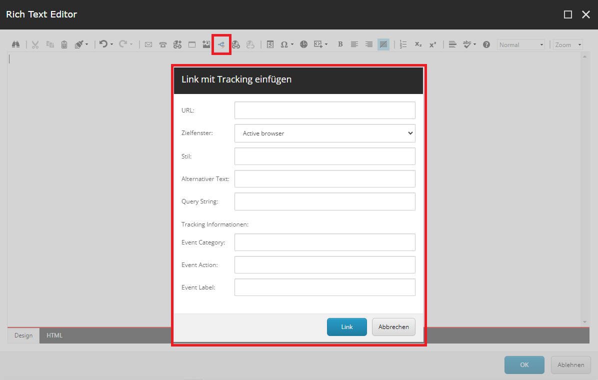

Based on the previous blog post about ([extenting Sitecore's general link](/11-steps-to-extend-general-link)), you may also want to enhance the content editing experience for your editors by extending the rich text editor with your newly created link.

In this tutorial, I’ll guide you through the steps to create a custom dialog for Sitecore’s rich text editor. To achieve this, follow the specified steps:

## 1. Create your custom DialogForm class

The first thing you need to do is create your custom DialogForm. It should derive from DialogForm, and you’ll need to override `OnCancel` and `OnOK` methods.

For example: Extending General Link Fields with Tracking Data

As in our example, you want to enhance the general link fields in your custom dialog by adding tracking data, specifically the fields EventCategory, EventAction, and EventLabel. You can follow these steps:

* Create your custom `DialogForm` class, inheriting from the base `DialogForm`.
* Override the `OnCancel` and `OnOK` methods to handle the dialog behavior.
* In the OnOK method, retrieve the values from your custom fields (e.g., EventCategory, EventAction, and EventLabel).
* Append these values to the result or perform any other necessary actions based on the user’s input.

```c#
using Sitecore;
using Sitecore.Diagnostics;
using Sitecore.Shell.Applications.ContentEditor;
using Sitecore.Text;

using Sitecore;
using Sitecore.Diagnostics;
using Sitecore.Web.UI.HtmlControls;
using Sitecore.Web.UI.Pages;
using Sitecore.Web.UI.Sheer;

using System;
using System.Diagnostics.CodeAnalysis;
using System.Text;

namespace Your.own.namespace
{
	[ExcludeFromCodeCoverage]
	public class InsertLinkWithTracking : DialogForm
	{
		protected Edit URL;
		protected Combobox Target;
		protected Edit Class;
		protected Edit Title;
		protected Edit Querystring;
		protected Edit EventCategory;
		protected Edit EventAction;
		protected Edit EventLabel;

		protected override void OnCancel(object sender, EventArgs args)
		{
			Assert.ArgumentNotNull(sender, "sender");
			Assert.ArgumentNotNull(args, "args");
			if (this.Mode == "webedit")
			{
				base.OnCancel(sender, args);
			}
			else
			{
				SheerResponse.Eval("scCancel()");
			}
		}

		protected override void OnOK(object sender, EventArgs args)
		{
			Assert.ArgumentNotNull(sender, "sender");
			Assert.ArgumentNotNull(args, "args");
			if (string.IsNullOrWhiteSpace(URL.Value))
			{
				SheerResponse.Alert("Bitte geben Sie die URL ein.", Array.Empty<string>());
			}

			if (this.Mode == "webedit")
			{
				base.OnOK(sender, args);
			}
			else
			{
				var result = new StringBuilder($"href=\"{URL.Value}");
				if (!string.IsNullOrWhiteSpace(Querystring.Value))
				{
					if (Querystring.Value.StartsWith("?"))
					{
						result.Append(Querystring.Value);
					}
					else
					{
						result.Append($"?{Querystring.Value}");
					}
				}
				result.Append('"');
				if (!string.IsNullOrWhiteSpace(Target.Value))
				{
					switch (Target.Value)
					{
						case "New":
							result.Append(" target=\"_blank\"");
							break;
					}
				}
				if (!string.IsNullOrWhiteSpace(Class.Value))
				{
					result.Append($" class=\"{Class.Value}\"");
				}
				if (!string.IsNullOrWhiteSpace(Title.Value))
				{
					result.Append($" title=\"{Title.Value}\"");
				}

                // Custom fields for tracking link
				if (!string.IsNullOrWhiteSpace(EventCategory.Value)
					&& !string.IsNullOrWhiteSpace(EventAction.Value)
					&& !string.IsNullOrWhiteSpace(EventLabel.Value))
				{
					result.Append($" data-clickevent=\\'{ {\"eventCategory\": \"{EventCategory.Value}\", \"eventAction\": \"{EventAction.Value}\", \"eventLabel\": \"{EventLabel.Value}\"} }\\'");
				}

				SheerResponse.Eval($"scClose('{result}')");
			}
		}

		protected string Mode
		{
			get
			{
				string str = StringUtil.GetString(base.ServerProperties["Mode"]);
				if (!string.IsNullOrEmpty(str))
				{
					return str;
				}
				return "shell";
			}
			set
			{
				Assert.ArgumentNotNull(value, "value");
				base.ServerProperties["Mode"] = value;
			}
		}
	}
}
```

Remark:
* Each line of code except the custom field part originates from the decompiled source of the Sitecore's code.
* It is recommended to place the file in "...\sitecore\shell\Controls\Rich Text Editor\..." where all the general controls for the rich text editor of Sitecore are placed.

## 2. Create the XML for your custom dialog
The next step is to create the visual presentation of the dialog. Therefore, you have to create an XML file which contains the control definition for the dialog.
In the example you can find the tree new fields (EventCategory, EventAction and EventLabel) for our custom tracking link. Additionally, the `CodeBeside` links to our previous created class.

```XML
<?xml version="1.0" encoding="utf-8" ?>
<control xmlns:def="Definition" xmlns="http://schemas.sitecore.net/Visual-Studio-Intellisense">
	<RichText.InsertLinkWithTracking>
		<FormDialog Icon="office/32x32/edit_in_workflow.png"
					Header="Link mit Tracking einfügen"
					Text=""
					OKButton="Link">
			<script Type="text/javascript" Language="javascript" Src="/sitecore/shell/Controls/Rich Text Editor/InsertLinkCommon.js">.</script>
			<CodeBeside Type="Your.own.namespace.InsertLinkWithTracking, YourSolution"/>

			<GridPanel Class="scFormTable" Width="100%" CellPadding="2" Columns="2" GridPanel.VAlign="top" GridPanel.Style="padding-left: 20px">
				<Literal Text="URL:" GridPanel.NoWrap="true"/>
				<Edit ID="URL"/>

				<Label for="Target" GridPanel.NoWrap="true">
					<Literal Text="Target Window:"/>
				</Label>
				<Combobox ID="Target" Width="100%">
					<ListItem Value="Self" Header="Active browser"/>
					<ListItem Value="New" Header="New browser"/>
				</Combobox>

				<Literal Text="Style Class:" GridPanel.NoWrap="true"/>
				<Edit ID="Class"/>

				<Literal Text="Alternate Text:" GridPanel.NoWrap="true"/>
				<Edit ID="Title"/>

				<Literal Text="Query String:" GridPanel.NoWrap="true"/>
				<Edit ID="Querystring"/>

				<Literal Text="Tracking Informationen:" GridPanel.Colspan="2"/>

				<Literal Text="Event Category:" GridPanel.NoWrap="true"/>
				<Edit ID="EventCategory"/>

				<Literal Text="Event Action:" GridPanel.NoWrap="true"/>
				<Edit ID="EventAction"/>

				<Literal Text="Event Label:" GridPanel.NoWrap="true"/>
				<Edit ID="EventLabel"/>
			</GridPanel>
		</FormDialog>
	</RichText.InsertLinkWithTracking>
</control>
```

## 3. Add your custom control to the rich text commands
In the third step, you need to extend the out-of-the-box JavaScript file that calls your dialog. Therefore, you can copy the default "RichText Commands.js"file from Sitecore and extend it with your newly created control. It is recommended to also place the file in "...\sitecore\shell\Controls\Rich Text Editor\...".

For our example, we added the following code snippet:

```javascript
// Add the action from the HTML Edit Button Item to CommandList.
Telerik.Web.UI.Editor.CommandList["InsertLinkWithTracking"] = function (commandName, editor, args) {
	var d = Telerik.Web.UI.Editor.CommandList._getLinkArgument(editor);
	Telerik.Web.UI.Editor.CommandList._getDialogArguments(d, "A", editor, "DocumentManager");
	scEditor = editor;
	// Call the dialog box.
	editor.showExternalDialog(
		"/sitecore/shell/default.aspx?xmlcontrol=RichText.InsertLinkWithTracking&la=" + scLanguage,
		null, //argument
		500, //Width
		550, //Height
		scInsertLinkWithTrackingCallback, //callback
		null, // callback args
		"InsertLinkWithTracking",
		true, //modal
		Telerik.Web.UI.WindowBehaviors.Close, // behaviors
		false, //showStatusBar
		false //showTitleBar
	);
};

// The function is called when the user closes the dialog.
function scInsertLinkWithTrackingCallback(sender, returnValue) {

	if (!returnValue) {
		return;
	}
	var selectedHtml = scEditor.getSelectionHtml();
	if (typeof selectedHtml === "undefined") {
		scEditor.pasteHtml("", "DocumentManager");
	} else {
		scEditor.pasteHtml("<a " + returnValue.text + ">" + selectedHtml + "</a>", "DocumentManager");
	}
};
```

## 4. Add a custom button for the rich text editor
Last but not least a button needs to be placed on the rich text so that the dialog can be triggered. 

Therefore follow these steps:
* Switch the database in Sitecore to the core database and navigate to the following path: "/sitecore/system/Settings/Html Editor Profiles". Here, you’ll find various rich text editor profiles that you can customize.
* Select the profile you want to extend. For example, let’s say you choose the “Rich Text Full” profile.
* Add a `Html Editor Button` to the toolbar. In our example we added the button to "Toolbar 1".
* Customize the button’s properties. In the Data section add your Click-Event to the field Click. In our example `InsertLinkWithTracking`.
* To make your button easily identifiable, add a meaningful icon.


## 5. Test your implementation
Now everything is implemented and you can test your custom dialog in the rich text editor by clicking the buton in the rich text toolbar.


If all fields are filled out, the output for our link with tracking will be as follows:

```html
<a href="/test" title="Link with tracking" data-clickevent="{'eventCategory': 'Test Category', 'eventAction': 'Test Action', 'eventLabel': 'Test Label'}">Custom link with tracking</a>
```

Remark: If the dialog shows an error message or doesn't load correctly, clear your cache and reload the page.

## Conclusion
Let’s wrap it up by summarizing the steps to extend the default rich text editor with your custom button:
* Create your custom DialogForm.cs file
* Create the control for your custom dialog
* Extend the JavaScript file with your control
* Add a "Html Editor Button" to the toolbar in the core database

As you can see, customizing the rich text editor with your own dialog is relatively straightforward and for your content editor, it is an important step to enhance the content editing experience.

