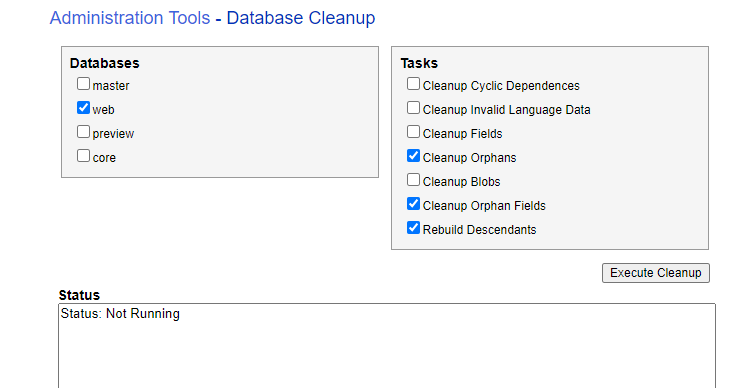

  

Recently on our live website, indexes stopped working while showing data from a particular page type. Also on these pages, most components were missing. Everything was working fine on the master database. In the logs, we found the following error:

```
Message: Could not map index document field to property "Paths" on type App.Foundation.Search.SearchResultItem : Guid should contain 32 digits with 4 dashes (xxxxxxxx-xxxx-xxxx-xxxx-xxxxxxxxxxxx). Actual value: [orphan]
```

Also, when we visited those pages on the web database and opened presentation details, it was not possible to check the datasource, because the browse button was throwing an error if the component datasource was coming from the local datasource. In the logs, we found the following error:

```
Exception: System.NullReferenceException
Message: Object reference not set to an instance of an object.
Source: Sitecore.XA.Foundation.LocalDatasources
   at Sitecore.XA.Foundation.LocalDatasources.RenderingDatasources.DatasourceSettingsProvider.GetSettingsItem(Item contextItem, ID renderingId)
   at Sitecore.XA.Foundation.LocalDatasources.RenderingDatasources.DatasourceSettingsProvider.HasSettings(Item contextItem, ID renderingId)
   at Sitecore.XA.Foundation.LocalDatasources.Pipelines.GetRenderingDatasource.AddAdditionalTemplates.Process(GetRenderingDatasourceArgs args)
   at (Object , Object )
   at Sitecore.Pipelines.CorePipeline.Run(PipelineArgs args)
   at Sitecore.Pipelines.DefaultCorePipelineManager.Run(String pipelineName, PipelineArgs args, String pipelineDomain, Boolean failIfNotExists)
   at Sitecore.Pipelines.DefaultCorePipelineManager.Run(String pipelineName, PipelineArgs args, String pipelineDomain)
   at Sitecore.XA.Foundation.LocalDatasources.CustomFields.FieldTypesEx.BucketInternalLink.ShowDialog(ClientPipelineArgs args)
```

So we had 2 different problems that might be connected.

With these clues in hand, we checked indexes for these page types. Then, found out that there were many cases with [orphan] assigned to the *_path* field. 

We tried rebuilding databases but it didn't help and [orphan]s stayed. 

Then we tried database cleanup from sitecore/admin/dbcleanup.aspx:



and rebuild indexes again. All orphans got cleared from indexes. 

Once we checked the error we got from local datasources, we also saw that the error was gone.

Indexes worked again, pages were showing components after clearing the caches.