Photo by <a href="https://unsplash.com/@growtika?utm_content=creditCopyText&utm_medium=referral&utm_source=unsplash">Growtika</a> on <a href="https://unsplash.com/photos/a-group-of-blue-boxes-ZfVyuV8l7WU?utm_content=creditCopyText&utm_medium=referral&utm_source=unsplash">Unsplash</a>

# Introduction
With a Kubernetes solution such as AKS, it is easier to scale the application according to your needs and simpler to deploy. However, troubleshooting is more difficult and requires different tools than with an app service solution.

# Tooling

## OpenLens
OpenLens is a GUI tool to manage Kubernetes clusters, without the need of extensive command line usage. It can be downloaded [here](https://github.com/MuhammedKalkan/OpenLens/releases).

### Pod Menu Extension 
With version 6.3.0, the Node / Pod Menu with the useful functionalities attach, shell and logs were removed from OpenLens.

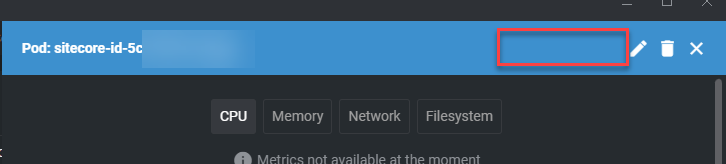

To bring it back, you can add the POD Menu Extension from [this repository](https://github.com/alebcay/openlens-node-pod-menu).

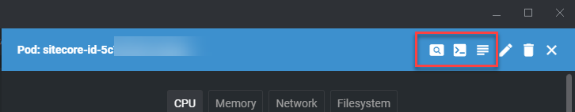

## Alternatives
Currently OpenLens is the tool I use, but since the project is no longer being maintained, there are alternative open source tools that I may use in the future. They are very similar, free, open source and actively in development, here are some examples:

* [K9s](https://github.com/derailed/k9s)
* [Jet Pilot](https://github.com/unxsist/jet-pilot)
* [Seabird](https://github.com/getseabird/seabird)

## Connection to Azure
To connect an AKS Cluster from your local machine, first close your OpenLens instance, go to the [Azure Portal](https://portal.azure.com), find your **AKS Cluster (1)**, go to **Overview (2)** and press **Connect (3)**.

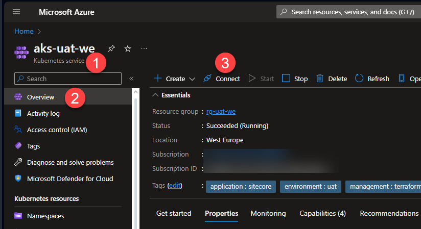

On the right side of the browser, a menu will open. Select Azure CLI and follow the instruction.

### Config file
Adding the cluster via Azure CLI will edit your Kubernetes config file on your machine. Usually, it's located on **C:\Users\USERNAME\.kube**

You may need to add the Kubernetes folder to OpenLens via menu, File, Preferences:

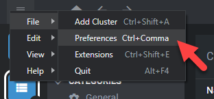

Go to Kubernetes (1), press Sync folder (2) and add the folder where the Kubeconfig file is stored C:\Users\USERNAME\.kube

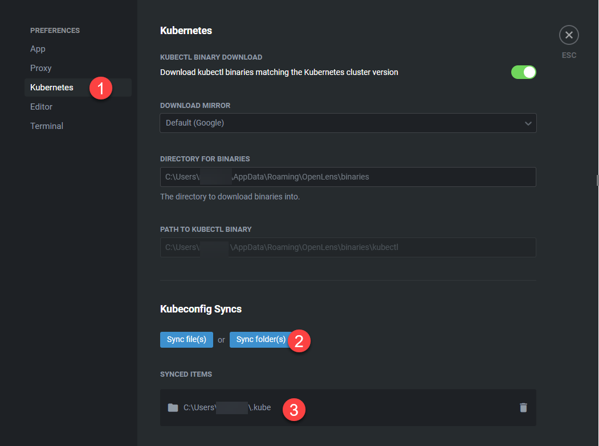

## Clusters in OpenLens
After adding the clusters, in the Catalog (1) select Clusters (2) and you will see all the added clusters (3) in the overview.

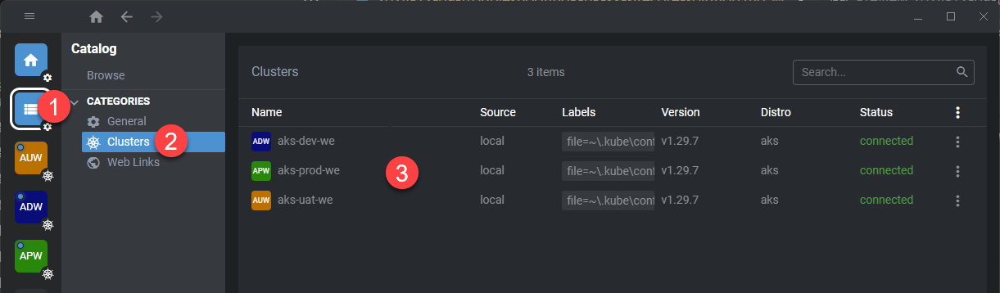

## Namespace filter
When you open the Pods menu (1), and see only one pod (2), it's possible that the selected namespace (3) is not the one you want. You can op the namespace dropdown menu (4) and select the one you want.

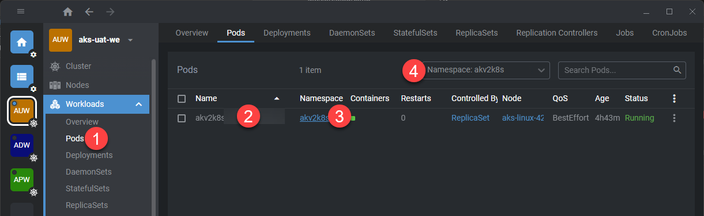

## Basic operations

### View and download logs
To view the live logs of a Pod, go to Workloads (1), then Pods (2), select the Pod (3), press Pod logs (4) from the pod menu extension, select the container (5) and the logs will shown in the terminal below (6).

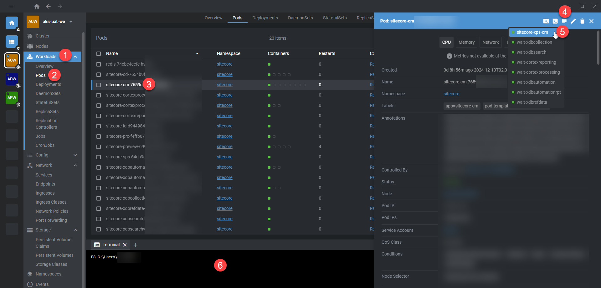

To download all logs, click on the Download button (1) and choose between All logs (2).

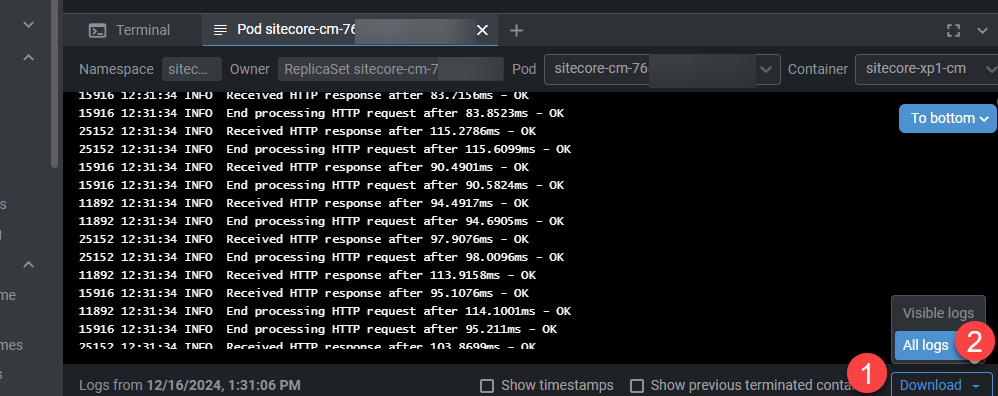

### Pod Shell
You can use the pod shell to use shell commands for example on the CM. Go to Workloads (1), then Pods (2), select the Pod (3) and press Pod Shell (4). The Pod Shell will open on the bottom (5) where you can navigate to a folder, list, read, or update files.

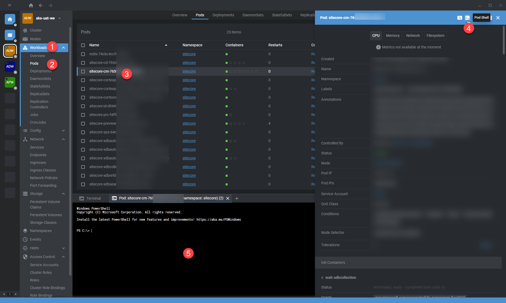

### Restart a deployment

Go to Workloads (1) - Deployments (2) select the deployment (3) you want to restart, press the restart button (4) and  confirm.

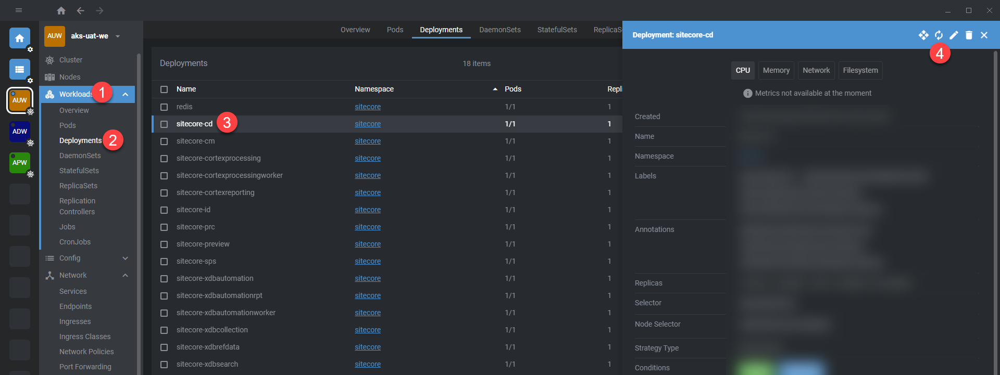

### The Terminal
There is a Terminal (1) in OpenLens, with that you can use directly kubectl commands without any additional installation.

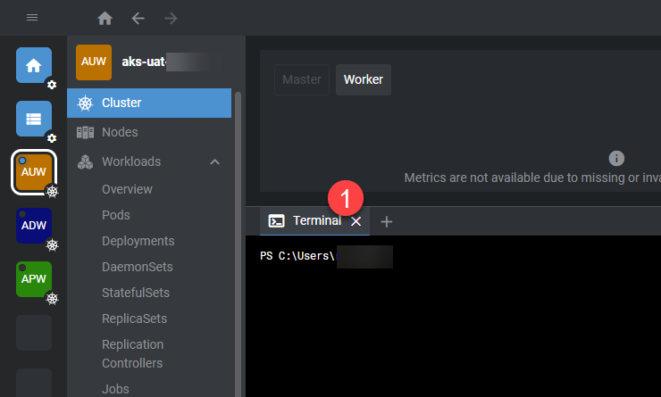

#### Copy files from a container to your computer
With the terminal, you can copy for example a dll to your local machine by using following command:


kubectl cp -n sitecore sitecore-cd-abcd123456-foo12:\inetpub\wwwroot\bin\website.dll .\localwebsite.dll


The command is composed as follows:


kubectl cp -n NAMESPACE sitecore-cd-YOUR-POD:PATH_TO_REMOTE.DLL .\LOCAL_PATH.DLL


#### Copy files from your computer to a container
Copying a local file to the remote container is based on the same principle:


kubectl cp .\localwebsite.dll -n sitecore sitecore-cd-abcd123456-foo12:\inetpub\wwwroot\bin\website.dll


# Conclusion
Troubleshooting an AKS solution can be a challenge, but with the right tools it can be easily managed. On the other hand, many things, such as deploying individual services without downtime, are much easier. We have been using OpenLens for a long time, it is a pity that the open source development has been discontinued, but there are many alternatives.
