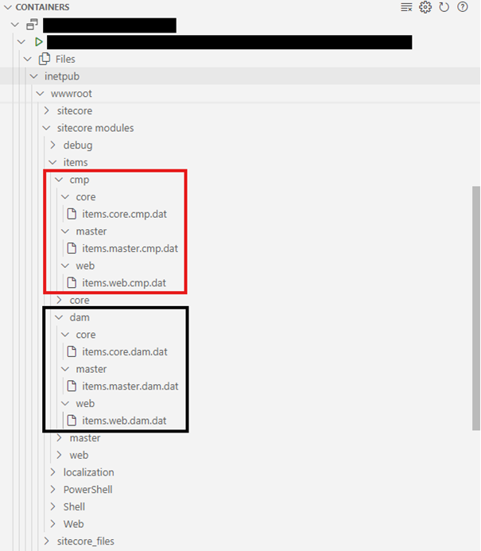
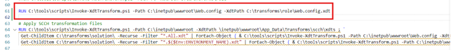

## Introduction
**Sitecore Connect for Content Hub (SCCH)** is a bridge between Sitecore Experience Platform and Sitecore Content Hub to synchronize data between the two platforms. It allows editors and marketers to work seamlessly with content created in Sitecore Content Hub. This integration helps maintain consistency and efficiency across different platforms.

With [SCCH version 5.2](https://developers.sitecore.com/downloads/Sitecore_Connect_for_Content_Hub/5x/Sitecore_Connect_for_Content_Hub_510/Release_Notes) Sitecore introduced many new features to the connector so we planned to do an upgrade of SCCH from version 5.0 to 5.2. Throughout this process I faced multiple challenges, which rendered this supposedly very small ticket to be more complex than expected.

The conditions I worked with were as follows:
*	Sitecore version 10.2.1.
*	Locally running on docker.
*	UAT and PROD running on Kubernetes.
*	We took the solution over from another agency and were not involved in the installation of the SCCH in the first place.

The goal was clear and the road ahead was [well documented](https://doc.sitecore.com/xp/en/developers/connect-for-ch/52/connect-for-content-hub/walkthrough--upgrading-scch-5-1-to-5-2-on-docker.html) so: “ready, set, go!”

## Initial challenges with the mssql-upgrade step

While going through the documentation, we first stumbled upon the mssql-upgrade step because we could not find any hint in the solution, that the already existing items were created utilizing an mssql-init image.

So, we asked Sitecore Support for clarification and got the response, that the mssql-upgrade image is not necessary when you have already version 5.0 or higher installed. The image is only used to clean old items from installations of versions lower than 5.0.

## Items as resources

From version 5.0 onwards SCCH is  utilizing **“Items as resources”**. This approach was introduced with Sitecore 10 and allows to store items not in the database but in the  file system instead. So, the needed items for the upgraded SCCH should be present as files in the image, that we import to our CM image. During startup Sitecore loads the synchronized items from the file into the Content Editor.

To verify, that it worked we simply look for the following two folders in the item tree:
*	/sitecore/system/Modules/CMP
*	/sitecore/system/Modules/DAM

These items belong to the SCCH and are included in the docker image as **.dat** files.

## Resource merger issues

*“So I can simply update the CM docker image according to this [documentation](https://doc.sitecore.com/xp/en/developers/connect-for-ch/52/connect-for-content-hub/walkthrough--preparing-to-install-the-scch-connector-module-in-a-container-environment.html#build-the-docker-images) and DLLs, configs and also the items will be deployed to my CM container”*, I thought.

However, the items were not there and with the benefit of hindsight I can say that next I went down a rabbit hole into the completely wrong direction.

I start to further investigate on “Items as resources.”

First, I confirm that the files are properly copied to the CM container, no issue here.



But when I check the logs, I find entries from the “Resource merger”, where I see, that it works generally, only the files from “sitecore modules” are ignored:

```
2788 21:26:40 INFO  Resource merger: file C:\INETPUB\WWWROOT\SITECORE MODULES\ITEMS\CMP\MASTER\ITEMS.MASTER.CMP.DAT, updated item definitions count = 0.
2788 21:26:40 INFO  Resource merger: file C:\INETPUB\WWWROOT\SITECORE MODULES\ITEMS\CMP\MASTER\ITEMS.MASTER.CMP.DAT, new item definitions count = 65.
2788 21:26:40 INFO  Resource merger: file C:\INETPUB\WWWROOT\SITECORE MODULES\ITEMS\CMP\MASTER\ITEMS.MASTER.CMP.DAT, updated shared definitions count = 0.
2788 21:26:40 INFO  Resource merger: file C:\INETPUB\WWWROOT\SITECORE MODULES\ITEMS\CMP\MASTER\ITEMS.MASTER.CMP.DAT, new shared definitions count = 65.
```

While looking for the cause of this issue I learned about Protobuf, which is the serializer that is used for the items, that are stored on disk and about the [Sitecore Protobuf Browser](https://github.com/GAAOPS/Sitecore.Protobuf.Browser) – a nice tool to compare multiple files. I used this to compare the serialized items of 5.0 and 5.2 to make sure, there are no incompatible items included, without success though.

So next I check for any misconfigurations and look at that, these filePaths look suspicious:


<protobufItems type="Sitecore.Data.DataProviders.ReadOnly.Protobuf.ProtobufDataProvider, Sitecore.Kernel" patch:source="Customer.Project.ChubConnector.config">
<filePaths hint="list" patch:source="Customer.Project.ChubConnector.config">
<filePath>/App_Data/items/$(id)</filePath>
<modulesFilePath>/sitecore modules/items/$(id)</modulesFilePath>
</filePaths>
</protobufItems>


The way these paths are configured, they will not pick up the files from the CMP and DAM modules, so I add these two lines via patch file to the databases:


<cmpModulesFilePath>/sitecore modules/items/cmp/$(id)</mpModulesFilePath>
<damModulesFilePath>/sitecore modules/items/dam/$(id)</damModulesFilePath>


I rebuilt the image and now the items were there. At this point I was sure, that I found a bug in the chub-assets image (this will turn out to be false). I checked in my changes, deployed to UAT, tested the Connector … and it did not work. The items were there, but when I tried to pick an asset from the DAM, the dialogue stayed blank.

## Missing configurations

I debugged the dialogue and quickly found out, that an api request to **/sitecore/api/dam/MContent/GetAuthenticationDetails** is returning a 404.

This api endpoint is defined in a DLL from the SCCH module and I could also confirm that this DLL was properly deployed to the CM instance.

Now do you remember, how I was chasing that white rabbit named “Items as resources?” Because next I did something, I should have done in the first place. I checked the showconfig.aspx, if the module configs were applied and if the processor that registers the api route is added. At this point I realized that none of the configurations were applied to Sitecore. I checked again the config files inside the module image and learned, that they require a certain setting: 


<sitecore damEnabled:require="yes">…</sitecore>


This turns out to be a change introduced with version 5.1 and you can also find the documentation to [Enable CMP or DAM](https://doc.sitecore.com/xp/en/developers/connect-for-ch/latest/connect-for-content-hub/enable-cmp-or-dam.html) here.

## Implementing the final fixes

But I had to clear out one last hurdle, because the config change just would not apply, no matter what I tried and eventually I found a mistake in our dockerfile, where the transformations from the SCCH module are done after our custom transformations and the module contains a transformation itself, that explicitly sets the values to false.


> This must run last.

After reordering the transformation steps, the settings finally changed to “yes” and I could see, that all configs were correctly applied – including the supposedly missing resource paths, as I described earlier, which I thought was a bug and all is fine and working.

After hours of work, which could have been an hour I could finally declare sweet victory.

## Conclusion

What do I take from this endeavor?

1.	When in doubt, check the showconfig.aspx **first**.
2.	I learned about items as resources.
3.	Do not forget release notes when doing an upgrade, e.g. [Release Notes for SCCH 5.1.0](https://developers.sitecore.com/downloads/Sitecore_Connect_for_Content_Hub/5x/Sitecore_Connect_for_Content_Hub_510/Release_Notes)

Even with all the challenges I faced I am still happy with the result, as I was able to learn a few new things but would be just as happy, if this post saves someone a couple of head scratches and hours.


Head image by <a href="https://unsplash.com/@interactivesports?utm_content=creditCopyText&utm_medium=referral&utm_source=unsplash">Interactive Sports</a> on <a href="https://unsplash.com/photos/white-track-field-with-white-ramsp-VYTQNnaboUA?utm_content=creditCopyText&utm_medium=referral&utm_source=unsplash">Unsplash</a>
      