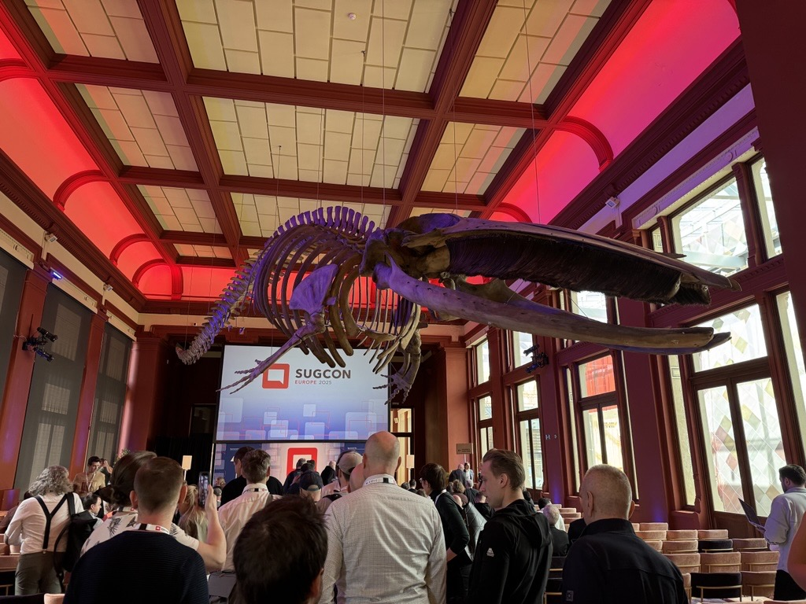

On April 3-4, the 10th Sitecore User Group Conference took place in Antwerp, Belgium. For one and a half days, community members from all over the world could meet and exchange ideas at the incredible venue "A Room with a Zoo".

I had already attended a Symposium in the past as well as multiple [Sitecore User Group Germany](https://www.sitecore-usergroup.de/) meetups. But this was the first time I could visit SUGCON, and I was excited to learn about the latest product developments, get inspiration from other Sitecore developers, and meet new and old friends.

As you would expect, the dominating topics were AI and especially Sitecore Stream, and XM Cloud. But I enjoyed seeing innovative solutions from other community members and hearing about new and planned features from the Sitecore product teams.

In this post, I will share a brief recap of my highlight sessions and my personal opinion on some of these topics.

## Day 1

Since I was traveling that day, I could not attend the two workshops on migrating XM/XP to XM Cloud best practices and Content Hub optimizations. The event started with the opening keynote.

### Keynote: Powering the Future of Sitecore

The event was kicked off by Sitecore CEO Dave O'Flanagan. He shared with us the future roadmap of Sitecore and the key role that AI and Sitecore Stream will play in it, even for the "old" XM/XP solutions that Sitecore is still committed to further maintain and innovate, and which can also utilize Sitecore Stream.

We got a glimpse of the new XM Cloud App Marketplace, which will allow developers to deploy custom plugins to XM Cloud and share them with others via the Marketplace.

In a short demo, we also saw the "CI Hub" connector, which can be used to easily integrate Content Hub with your typical Office or Creative Software like Photoshop or PowerPoint.

### Events, Webhooks, & the Authoring API

Jason Wilkerson demonstrated in this session how webhooks and events can be utilized to run custom logic on items. He showcased a custom-built app that can create new content within XM Cloud only by API and without opening the Content Editor once, which could, in a further step, also be used for automation.

It was good to see how customizations in the SaaS world can still work and what tools developers can use, especially when planning to move from XM/XP to XM Cloud, where we see a huge shift in how backend logic can be built.

### Unlocking the Power of Sitecore Search

Jeroen Speldekamp brought us three hands-on proof of concepts:
1. How to use Geo data for a distance-aware search 
2. How to use marketing campaigns to trigger certain rules
3. How to easily generate a simple chatbot/FAQs by generating questions and answers with Sitecore Stream based on data that was indexed from a website

Here I really enjoyed the innovative way Sitecore Stream was used to speed up a tedious process like generating an FAQ and seeing the power of Sitecore Search in action.

## Day 2

Day 2 started early after a great community dinner the evening before, where I had the chance to meet and exchange with others, digest all the information from that day, and enjoy great food.

The first session of the day was an update on Sitecore Stream in XM and XP.

### Sitecore Stream in DXP

Vignesh Vishwanath demonstrated how the Sitecore Stream features will be integrated into XM and XP and how they can be installed. My key takeaways:
- Minimum version is 10.2
- A Sitecore Cloud Portal account is required
- Stream can be downloaded as an installable module
- It is available as a free tier or paid subscription
- It's a bit tricky to find the module, so best you contact your respective partner manager

### Step-by-Step Optimization for Next.js and Sitecore JSS

This session by Alex Hawley, I did not attend, but it was highly praised by many people I talked to. I can recommend this blog post, though, that covers the same topic: [How to Optimize Next.js + Sitecore JSS](https://vercel.com/guides/how-to-optimize-next.js-sitecore-jss).

He also holds this talk on other platforms, so keep an eye on the Slack channels if you have also missed his talk at SUGCON.

### Elevating Developer Experience: Modernizing the JSS SDK and Starter Kits for XM Cloud

Liz Nelson and Christian Hahn presented the new "Content SDK", which is at the moment still in beta version but is expected to go to first release within the next few months.

The Content SDK is a reduced version of the JSS SDK. These reductions were achieved by removing all code that is related solely to XM and XP (e.g., the Experience Editor). So the new Content SDK will only work for XM Cloud and from now on, both SDKs will be developed independently from each other.

You can already check out the Content SDK [here](https://github.com/Sitecore/content-sdk). If you are starting a new project now, the recommendation from Sitecore is to already start using the Content SDK as its first stable release is expected very soon. If you plan to migrate your JSS SDK app to Cloud SDK, you should wait for the official release.

The same has been done for the XM Cloud starter kits, which received a major rebrush to make it easier to understand and to create as little boilerplate code as possible.

### Accelerating Success 

Katharina Luger gave a nice lightning talk introducing the Sitecore Acceleration campaign with the most interesting part being the cookbook: [Sitecore Accelerate Cookbook](https://developers.sitecore.com/learn/accelerate).

This is a collection of best practices where developers and consultants can find recommended solutions or approaches based on certain scenarios.

Currently, they cover XM Cloud and Content Hub, but the rest of the Cloud portfolio as well as XM and XP is already planned. So it is worth revisiting the page from time to time and checking for updates.

### Sitecore's Marketplace Roadmap Review & Developer Program

Krassi Eneva and Justin Vogt gave us a deeper look into the new XM Cloud App Marketplace.

The Marketplace is still in a closed testing phase and is planned to be published later this year. What we already know:
1. Apps can have three scopes:
    1. Public: Available to everyone on the Marketplace (apps can be made free, paid, or freemium)
    2. Organization: Apps are available across multiple projects in the same organization (e.g., if you want to reuse a certain feature across multiple customer projects)
    3. Private: Can only be used on one certain project (makes sense if the app covers very specific business logic)
2. Apps will be reviewed by Sitecore including the design
    1. It is not necessary but recommended to use Sitecores [Blok Design System](https://blok.sitecore.com/)
3. The [Marketplace SDK](https://github.com/Sitecore/sitecore-marketplace-sdk) is already available
4. Apps can extend certain functionalities like Pages or create new Dashboards

I'm looking forward to this new platform and what exciting ideas the community will come up with to extend Sitecore functionalities.

### A Walk-through of XM Cloud Content

In the last session, Alistair Deneys gave a very hands-on demonstration of Sitecore's new CMS "XM Cloud Content". This will be a truly headless lightweight CMS with a couple of nice extra features.

In his demo, Alistair created a simple blog post including referenced authors by only using XM Cloud Content's API. The demo included the whole process from defining the content structure to eventually publishing and requesting the created content.

He also highlighted the simplified architecture, that there will not be a separate WEB database, and publishing an item will simply change the entry's publishing field. This has the nice effect that scheduled publications are easily possible out of the box.

Alternatively to the API, XM Cloud Content has an intuitive user interface as well, where users can define new content templates, create new content, and maintain it.

Right now, this new product is still under development and I am already looking forward to getting some hands-on experience with XM Cloud Content.

## Closing Words

My first SUGCON ended with the closing ceremony and I left with many new impressions and ideas. I cannot wait to apply my learnings to real projects and I will be looking forward to the next SUGCON event.

Big thanks to all organizers, speakers, and all the people involved in making this great community event possible.
