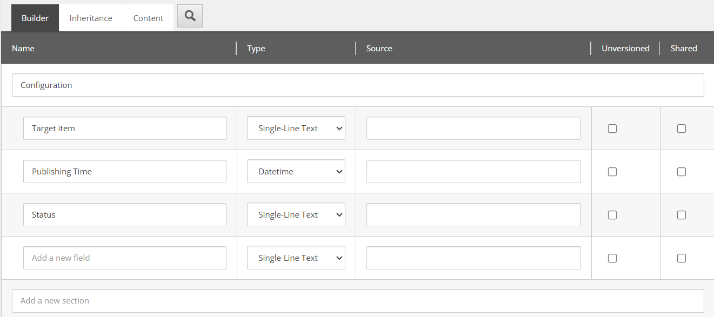
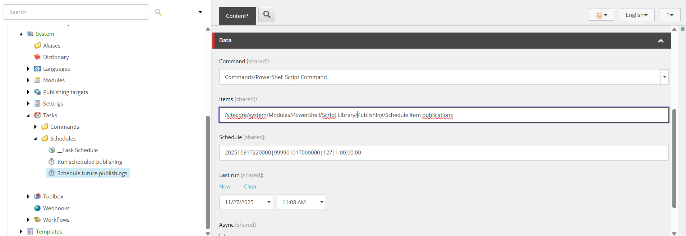
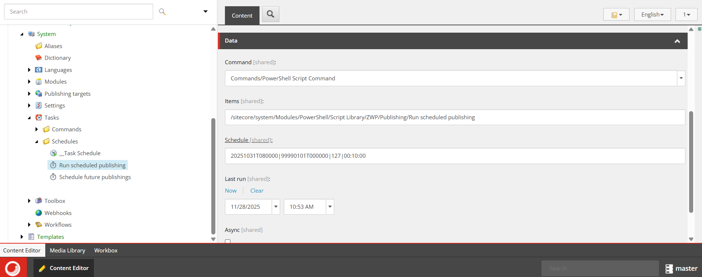

## Implementing scheduled content publishing in SitecoreAI

After migrating from Sitecore XP to SitecoreAI/XM Cloud, one of my clients was facing the challenge, that the scheduled publishing feature that they previously used is no longer available due to SitecoreAIs restrictions to deploy custom code to the back end.

Sitecore XP as well as SitecoreAI already support [restricting content publication to certain time windows](https://doc.sitecore.com/sai/en/users/sitecoreai/schedule-availability-for-a-content-item.html#make-a-version-unavailable-for-publication) but this is only to __mark content as being publishable__. When the time comes and the item can be published, it still requires someone actively hitting the publish button for that item.

Now I was tasked to implement a scheduled publishing, that should be as close as possible to the old solution to make it as easy as possible for content editors to transition. Requirements were as follows:
 - Content authors can schedule content publications by configuring the out of the box publishing restrictions.
 - It is not required, that scheduled content publishing is exact to the second and some delay is acceptable.
 - At this point scheduled depublishing is not a requirement

## Solution

The solution is based on two [Sitecore Powershell Extensions](https://doc.sitecorepowershell.com/) scripts that run on a schedule. One script fills up a publishing queue with information which item is due at which time. The other script simply runs through the queue and triggers content publishing based on the item configurations in that queue.

### Filling up the queue

For the schedule items we create one new template 'Publishing schedule' like this:



The script to fill the publishing queue is called "Schedule item publications" and looks like this:

```powershell
$scheduleFolderPath = '/sitecore/system/settings/Feature/Scheduled Publishing/Publishing schedules/'
$scheduleItemTemplate = '/sitecore/templates/Feature/Scheduled Publisher/Publishing schedule'
$languageVersion = "de-DE"
$debug = $false

function Schedule-Future-Publishing {
    param (
        [string]$itemId
    )
    
    $items = Get-Item -Path "master:" -ID $itemId -Language $languageVersion -Version *
    
    if($debug) {
        if($items.GetType().ToString() -eq 'Sitecore.Data.Items.Item'){
            $path = $items.Paths.FullPath
        } else {
            $path = $items[0].Paths.FullPath
        }
        Write-Host 'Evaluating ' $path
    }

    # Get current UTC time
    $utcNow = [DateTime]::UtcNow.ToString('yyyyMMddTHHmmssZ')
    
    foreach($item in $items) {
        # Here we compare the publishing restrictions with the current date and time
        # If the item has a publishing date, that lies in the future, we create a new item in the publishing queue
        $validFrom = Get-ItemField -IncludeStandardFields -Item $item -ReturnType 'field' -Name "__Valid from"
        
        if($debug) {
            Write-Host 'Comparing: ' $validFrom.Value ' > ' $utcNow ' is: ' ($validFrom.Value -ge $utcNow)
        }
        if($validFrom.Value -ge $utcNow) {
            $targetPath = $scheduleFolderPath + $validFrom + '_' + $item.ID.ToShortID()
            $createdItem = New-Item -Path $targetPath -ItemType $scheduleItemTemplate
            
            $createdItem.Editing.BeginEdit()
            $createdItem["Target Item"] = $item.ID
            $createdItem["Publishing Time"] = $validFrom.Value
            $createdItem["Status"] = 'Pending'
            $createdItem.Editing.EndEdit()
            
            if($debug) {
                Write-Host 'Added ' + $targetPath
            }
        }
    }
}

# Here we can configure all directories, in which we search for scheudled items
$contentDirectories = @(
    '/sitecore/content/MyProject/Home',
    '/sitecore/content/MyProject/Data'
)

# Clear the folder first
# The queue is rebuilt on every run so items, that are already published are cleared from the queue
$childItems = Get-ChildItem -Path $scheduleFolderPath

foreach($childItem in $childItems) {
    Remove-Item -Path $childItem.Paths.FullPath -Force
}

# go through all subitems and their version and check for publishing restrictions
foreach($contentDirectory in $contentDirectories) {
    $contentDirectoryItem = Get-Item -path $contentDirectory -Language $languageVersion

    Schedule-Future-Publishing -itemId $contentDirectoryItem.ID
    
    $contentItems = Get-ChildItem -Path $contentDirectory -Recurse
    
    foreach($contentItem in $contentItems) {
        Schedule-Future-Publishing -itemId $contentItem.ID
    }
}

```

This script goes through a list of items, that we can configure and their child items and compares the field __Vaild from to the current date and time. If the field value is greater than the current datetime (i.e. the item is scheduled for a future time) we create a new item item based on our previously created item an put it into a folder, that serves as our publishign queue.

Via a scheduled task, we configure this script to run once every 24 hours. So the publishing queue is filled once a day.



### Running scheduled publshes

The second script we build will go through the publishing queue and publish items, as soon as their target date is reached. Items, that get published also have their Status set from 'Pending' to 'Published' so they are only considered once for publishing and when the queue is refilled the next time, it will not reappear, because the date lies in the past then.

```powershell
$scheduleFolderPath = '/sitecore/system/settings/Feature/Scheduled Publishing/Publishing schedules/'
$languageVersion = "de-DE"
$debug = $false

$db = Get-Database "experienceedge"
$lang = [Sitecore.Globalization.Language]::Parse($languageVersion)

$publishingSchedules = Get-ChildItem -Path $scheduleFolderPath

# Get current UTC time
$utcNow = [DateTime]::UtcNow.ToString('yyyyMMddTHHmmssZ')

foreach($publishingSchedule in $publishingSchedules) {
    $validFrom = $publishingSchedule["Publishing Time"]
    
    # only consider items with status Pending and ignore already published items
    if(($validFrom -lt $utcNow) -and $publishingSchedule["Status"] -eq 'Pending') {
        $targetItem = Get-Item $publishingSchedule["Target Item"] -Language $languageVersion
        
        # Smart publish, with related items, no subitems
        [Sitecore.Publishing.PublishManager]::PublishItem($targetItem, $db, $lang, $false, $true, $true)
        
        $publishingSchedule.Editing.BeginEdit()
        $publishingSchedule["Status"] = 'Published'
        $publishingSchedule.Editing.EndEdit()
        
        if($debug) {
            Write-Host 'Published: ' $publishingSchedule.Paths.FullPath
        }
    } else {
        if($debug) {
            Write-Host 'Not due: ' $publishingSchedule.Paths.FullPath
        }
    }
}
```

Again we create a scheduled task to run this script once every 10 minutes. As mentioned above it was not necessary to have the item go live at an exact time. This way, we have a maximum delay of 10 minutes to the configured time.



These two script fulfilled all requirements as agreed on with the customer and increased the editors day to day working experience by a far, because they could simply configure publishign restrictions for their items and be assured, that their content goes live without additional steps.

## Considerations

This may not be the most elegant solution and we considered a more efficient solution including webhooks and only triggering the schedule job, when an item is saved, so it is not necessary to evaluate all content over and over again.

But at this point, we decided to not introduce an additional external service that would be needed to handle the webhook and performance also looked fine with the current amount of content. The script to schedule the item publications ran for ~3 minutes with a volume of 30.000 items, that were evaluated.

Also I mentioned in the beginning, that depublishing is not considered at this point, because the customer is not utilizing the "Valid to" configuration at the moment. The script could be easily extended to cover that requirement as well, but for the sake of simplicity I left it out in this blog post.

I hope this will serve helpful to someone else looking for this common requirement and happy to hear about your solutions, how you solved this problem.

Head image was created via Copilot
