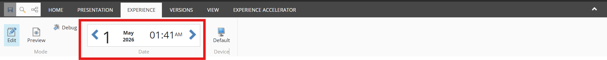
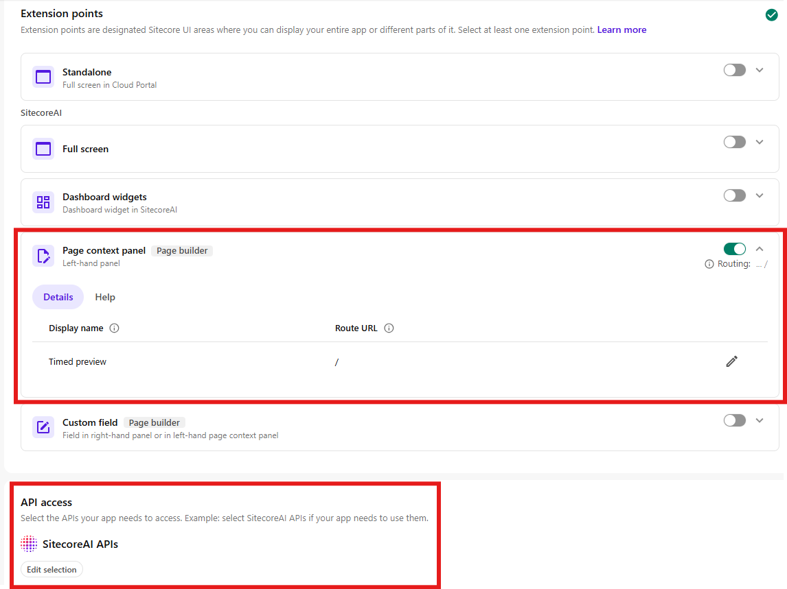
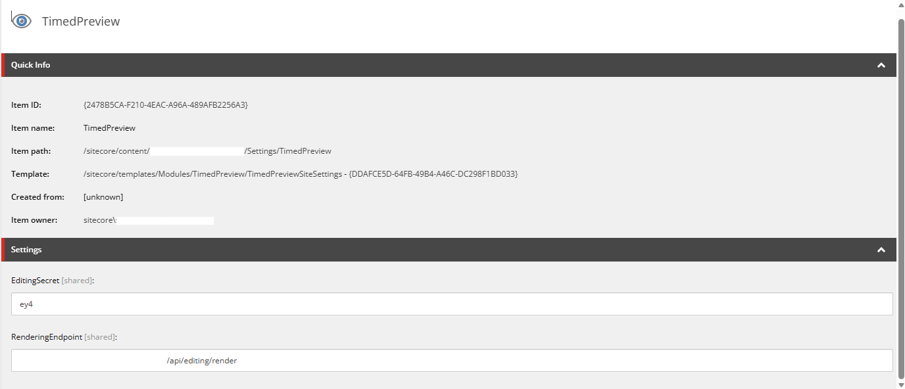

*Relaxing while a campaign goes live — thanks to previewing scheduled content in advance, authors can confidently verify that everything will appear exactly as intended when it matters most.*

## Overview

In this blog post I introduce a marketplace app I have recently been working on. The goal of this app is to give content authors the ability to do quality assurance of scheduled content, for example to verify that a banner scheduled to go live at midnight actually appears correctly before it publishes.

In the past, this was easily possible within the Experience Editor by changing the Preview Date and Time.

Unfortunately this functionality is no longer available in SitecoreAI Pages Editor and content authors are left to guess whether their scheduled content will display correctly.

I took this lack in functionality as an opportunity to test out the SitecoreAI Marketplace and built an app, that brings a scheduled preview to the SitecoreAI Pages Editor.

## How to use the app

After installing the marketplace app in your SitecoreAI environment, it is available on the top right of your SitecoreAI Pages Editor. Simply click the puzzle piece icon and select the app. Now a new panel should open on the left side of your editor.

The panel includes:

- A date and time picker where you can select a time to simulate in the preview window
- A preview frame, that displays your page with, as it will look at the defined time, with respect to the publishing restrictions
- A tab, where you can directly change the publishing restrictions of content items related to the page
- A tab with technical details, which gives you detailed feedback on which versions are currently visible in the preview frame

  <iframe 
    src="https://www.youtube.com/embed/o-xH6IpOr7Q"
    frameborder="0"
    allowfullscreen
    style="position: absolute; top:0; left:0; width:100%; height:100%;"
    referrerpolicy="strict-origin-when-cross-origin">
  </iframe>

<figcaption>This video shows the capabilities of the Preview Marketplace App in action.</figcaption>

## How to configure the app

You can find the code repository here: https://github.com/simonhck/timed-preview-marketplace-app

The app can be hosted on any platform that can run Next.js apps. During implementation I tested on Netlify, so the repo already contains the Netlify configuration files.

When you configure the app in 'App Studio', make sure to set the Route URL to / and grant API access to 'SitecoreAI APIs'.

In order to connect the preview to your rendering host, you need to add two configurations - editing secret and rendering endpoint.

This can be done either directly in the env variables of your marketplace app with keys: 

    JSS_EDITING_SECRET
    RENDERING_ENDPOINT

Or if you intend to use the app across multiple environments, a config item can be added to the settings folder of your site with values EditingSecret and RenderingEndpoint.

## Technical details

The app relies on some plugin code that you have to integrate into your head app. In the repository, you find it under **/target-site-plugin**.

Under the hood, the preview goes through several steps:

1. By comparing item versions and their configured publishing restrictions, the app determines which content will be overridden in the preview
2. These overrides are stored in a cookie mapped via the item ID
3. The head app is called within the preview frame
4. Within the head app, the plugin code retrieves the stored overrides and applies them to the layoutData before rendering the page

After these steps, the page is rendered within the preview frame with all overrides applied and all content is shown according to the configured publishing restrictions.

### Page router vs App router

This app is mainly tested and built on App router and has been very reliable during my tests.

There is a [separate branch](https://github.com/simonhck/timed-preview-marketplace-app/tree/experimental/page-router-support) in the repo that supports Page router, which I created for a client. However, this setup has been more shaky in my tests and you might need to make some adaptations based on JSS/Content SDK version, you are using on your project.

## Next steps / future plans

### Editing within the app

To allow the author to make some immediate changes while reviewing time restricted content, I would like to add some kind of editing capability to the app.

### Improved handling of app configurations

Sitecore has hinted at an improvement for marketplace apps, that they are working on to give administrators the ability to maintain app configurations directly in the app. This would be the ideal place to put the configurations for the rendering host, which is currently still in env variables or as item in SitecoreAI.

### Proper passing of preview parameters

Sitecore has hinted at improved preview capabilities for SitecoreAI, where users would be able to pass certain parameters directly to the preview via URL, including a preview time. Once available, this would make the workaround logic of this app obsolete.

There is no confirmed timeline for this change yet, and it could still be a while before it lands. In the meantime, this app provides a reliable solution that content authors can use today. Even once the native preview parameters arrive, the app will continue to serve as a polished interface for interacting with the preview, just without the need for the override logic under the hood.

## Feedback welcome

I'd be happy to hear from anyone who integrated this app into their project or just played around with it.

If you have any feedback or questions, feel free to contact me.
